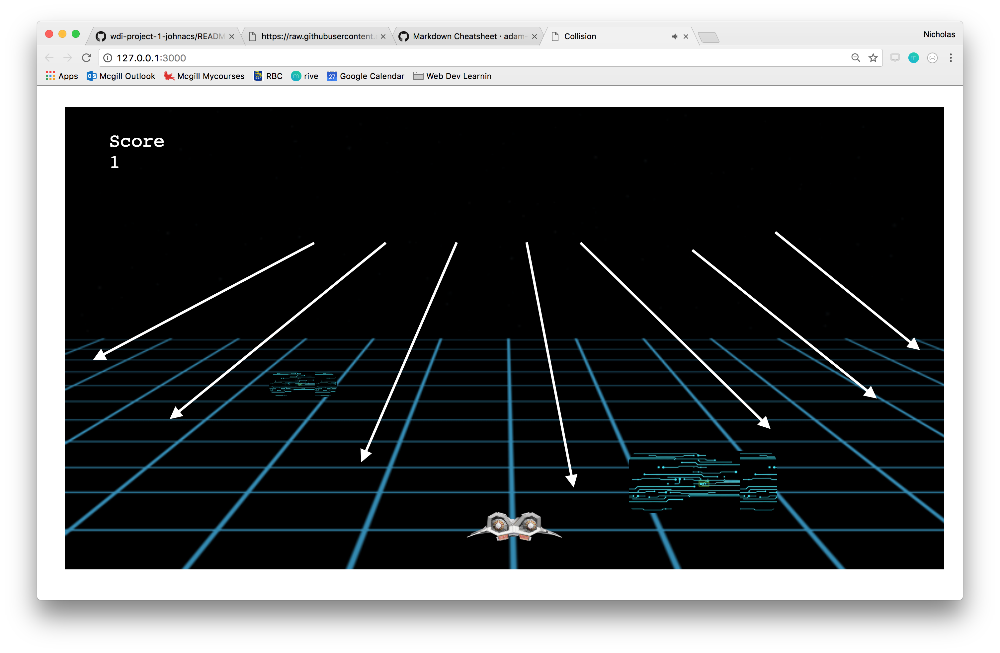

# COLLISION
---
## Gameplay - Instructions

Use :arrow_backward: and :arrow_forward: in order to dodge the walls that come at you! Remember to turn the sound up, and if you lose, input your name to log your highscore!

---
## Game mechanics and logic
---
### HTML
The HTML is fairly simple.
* The whole game is contained inside a div to allow scalability to different browser sizes (though a refresh is required)
* The background is a gif of a moving landscape
* The scoreboard consists of multiple divs that are set to appear when you lose. When 'play again' is clicked, they appear again
---
### CSS
The CSS allows the scalability of the game by setting widths and heights as relative percentages of their parent element. In my soft launch, the issue was that while my game worked on my local server, it didn't work when hosted of the github server.
* Everything is set relative to the large div so that they are relative to browser dimensions
---
### Javascript
Where all the ~magic~ DOM manipulation occurs. I have a lot of functions so bear with me.

init()
* initializes global variables and sets speed of blocks, spawn rate of blocks, and score.
* adjusts score.
* sets a lot of event listeners to listen for key presses, clicks
* sets a lot of interval timers to continually spawn and move walls.
* intervals are responsible for rate of wall spawn and movement. Listeners are responsible for new game, and ship movements

beginning()
* starts music playing and generates instructions for game (which fades away)

collision()
* checks if spaceship hits any walls

displayGameOver()
* if you lose, it sets the current scoreboard, the gameover div, and the playagain button to visible.
* it causes the spaceship to disappear

spawnWalls()
* creates a wall div and sets its width and height to random variables.

fall()
* causes wall divs to move downwards and expand, giving the illusion of a wall coming closer.

wallsMove()
* called by fall() function. Allows walls to go down (does a bunch of calculations based on browser size)

wallsX()
* Called by wallsMove(). Width is increased from the left, so this is offset by moving the wall left at the same rate at which the wall is expanding

---
## Media and resources used
For my project, I used:
* a tron themed gif that moves the floor and sky.
* a picture of the back of a spaceship
* a picture with a microchip design for the walls/obstacles
* tron theme song for the audio

---
## Challenges
The major issue I faced and eventually failed to overcome was the addition of perspective into my game.

It turns out, the addition of perspective is much harder than I thought. I tried to tackle the problem by multiplying the xvalue of the wall by the slope I wanted it go (using y = mx + b where m is the slope and x is the coordinate). However, while this did work for static walls, it did not work for walls that would expand. Also, because angles are different, the speeds are different. This would mean that I would have to adjust speeds and ratios for every single div element based on a function that takes their angle into account.

In short, I tried to complete a task but didn't overestimated the time it would take as well as the complexity. I hope to try again one day!
