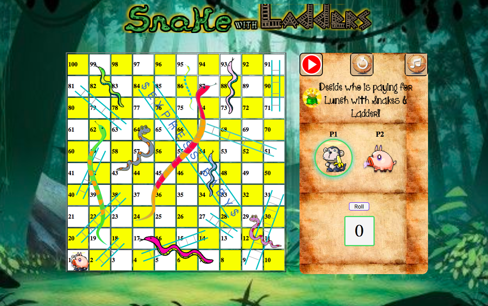
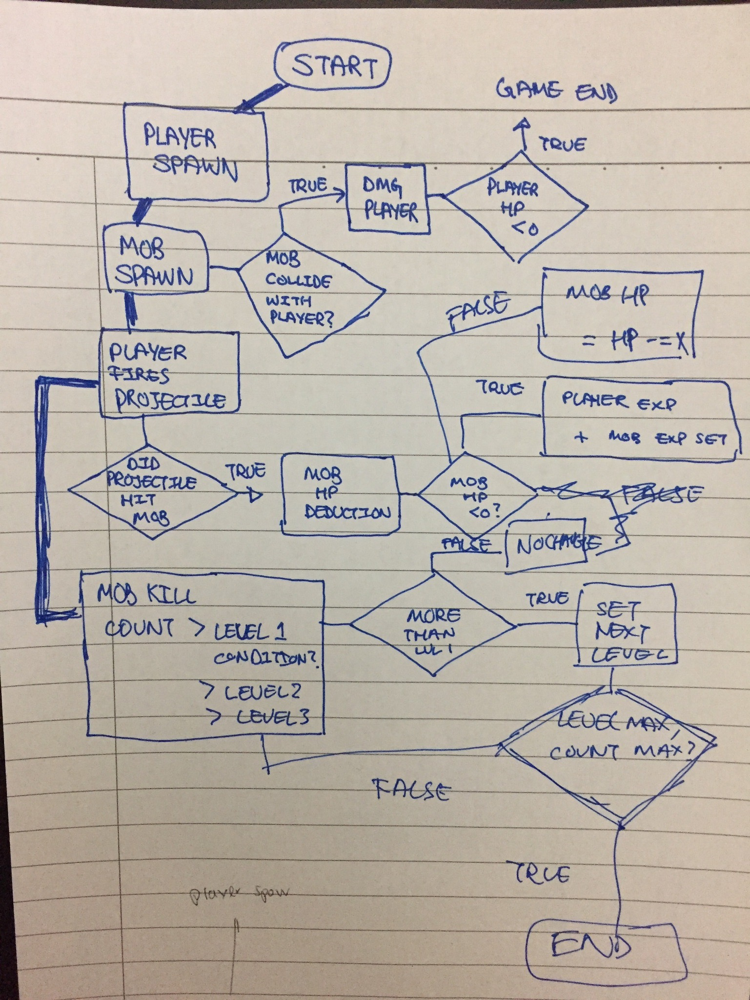
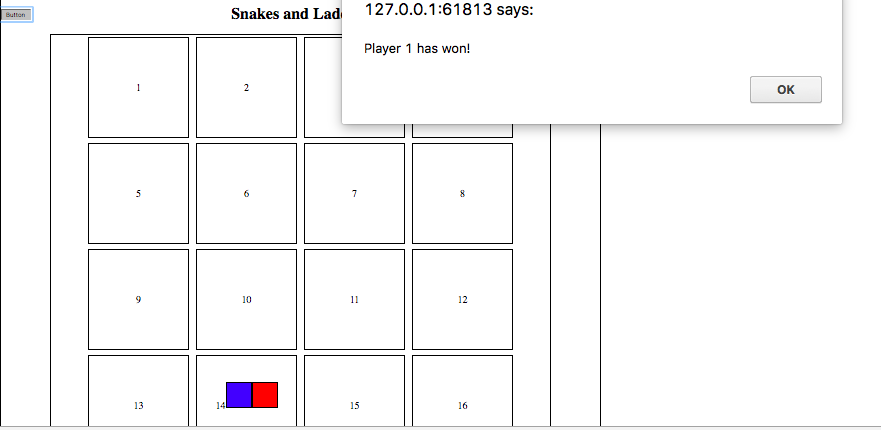

# Snake & Ladder

Game Link: https://matthewfrancisong.github.io/project-1/

## Table of Contents

1. How to play
2. Why Snakes & Ladders
3. My 7 days plan
4. Game Documentation
5. References

## How to Play

Goal: Reach above and beyond square numbered 100 at the top-left hand corner of the board.

Players begin at square number 1. Each player takes a turn to roll a dice and move them along the numbered squares. If a player lands on a square which has the base of a ladder, they will advance to the square that sits on the top of the ladder.

Similarly, if a player lands on a square which has the head of a snake, it would drop to the tail of the snake.

## Why Snakes & Ladders

When I was young, I played a lot. Everything from board games, donkey cards to remote-controlled cars. I thought how wonderful would it be to design the game that I actually played then. It was meaningful.

Some of the animated characters in this game brought me back to happy memories where I remembered slogging thousands of hours. It was all fun.  Wonderful memories to recollect and one day share with my family.

## 7 days Plan

#### 29th Sept
##### Day 1: (Friday)

1.  Flow-chart
2.  Pseudo Codes

#### 30th Sept
##### Day 2 & 3 (Weekend)

1. Create 16 grid MVP (Minimal Viable Game)

  * Logic to switch players
  * Win-Game condition. Create 2 markers. if >16, win game
  * Reset Function
  * Snakes & Ladders Logic

2. Make game functional

#### 2nd Oct
##### Day 4 (Monday)

1. Create actual game. (100 Grid)

Deliverables:
1. Jquery 100 Grid
  * Use JQuery to create 100 grids instead of using html.
  * Use for-loop to give each individual grid an ID.
  * Use modular function to alternate grid background color.
  * Reverse rows so that board number flows bottoms-up in a zig-zag fashion.
2. WhoWon() , Reset() , rollDice() Functions.

Challenges:
 * Refactoring html 16grid into Jquery nested loop function.
 * Create a div instead of '<table'. Learnt that table has its own properties.

#### 3rd Oct
##### Day 5 (Tuesday)

Deliverables:
1. Refactoring Snakes & Ladder Logic
2. Comparison analysis with other snakes and ladder board games to set difficuity.

Challenges:
* Choosing between creating an Array to house logic or a Switch statement
* Reduce player 1 and player 2 codes as there were many repetitions.

#### 4th Oct
##### Day 6 (Wednesday)

Deliverables: (CSS Styling)
1. Find snakes, ladder, and button images.  
2. Color & Style Snakes & Ladders
3. Use Sprite to animate my characters
4. Design Layout of landing page of divs

#### 5th Oct
##### Day 7 (Thursday )

Deliverables: (CSS Styling)
1. Cleaning up Codes
2. Cleaning up UI of page.
3. Inserted audio track
4. Created auto-play & reset feature

Challenges:
1. Tried to use transition-duration to create delay in my character movement.
2. Had to priortise on using the remaining time to touch up & style the layout.

#### 6th Oct
##### Day 8 (Friday)

Presentation Day!

## References
1. Font taken from FGOnlyHope
http://www.fontspace.com/kimberly-geswein/kg-onlyhope
2. Zombie Lupid Sprite - Ripped by Boo
3. Hog Sprite - Ripped by Mageker

#  Project #1: The Game

### Overview

Let's start out with something fun - **a game!**

Everyone will get a chance to **be creative**, and work through some really **tough programming challenges** – since you've already gotten your feet wet with Tic Tac Toe, it's up to you to come up with a fun and interesting game to build.

**You will be working individually for this project**, but we'll be guiding you along the process and helping as you go. Show us what you've got!

---

### Technical Requirements

Your app must:

* **Render a game in the browser**
* **Any number of players** will be okay, switch turns will be great
* **Design logic for winning** & **visually display which player won**
* **Include separate HTML / CSS / JavaScript files**
* Stick with **KISS (Keep It Simple Stupid)** and **DRY (Don't Repeat Yourself)** principles
* Use **Javascript** for **DOM manipulation**, jQuery is not compulsory
* **Deploy your game online**, where the rest of the world can access it
* Use **semantic markup** for HTML and CSS (adhere to best practices)
* **No canvas** project will be accepted, only HTML5 + CSS3 + JS please

---

### Necessary Deliverables

* A **working game, built by you**, hosted somewhere on the internet
* A **link to your hosted working game** in the URL section of your GitHub repo
* A **git repository hosted on GitHub**, with a link to your hosted game, and frequent commits dating back to the very beginning of the project
* **A ``readme.md`` file** with explanations of the technologies used, the approach taken, installation instructions, unsolved problems, etc.

---

### Suggested Ways to Get Started

* **Break the project down into different components** (data, presentation, views, style, DOM manipulation) and brainstorm each component individually. Use whiteboards!
* **Use your Development Tools** (console.log, inspector, alert statements, etc) to debug and solve problems
* Work through the lessons in class & ask questions when you need to! Think about adding relevant code to your game each night, instead of, you know... _procrastinating_.
* **Commit early, commit often.** Don’t be afraid to break something because you can always go back in time to a previous version.
* **Consult documentation resources** (MDN, jQuery, etc.) at home to better understand what you’ll be getting into.
* **Don’t be afraid to write code that you know you will have to remove later.** Create temporary elements (buttons, links, etc) that trigger events if real data is not available. For example, if you’re trying to figure out how to change some text when the game is over but you haven’t solved the win/lose game logic, you can create a button to simulate that until then.

---

### Potential Project Ideas

##### Blackjack
Make a one player game where people down on their luck can lose all their money by guessing which card the computer will deal next!

##### Self-scoring Trivia
Test your wits & knowledge with whatever-the-heck you know about (so you can actually win). Guess answers, have the computer tell you how right you are!

---

### Useful Resources

* **[MDN Javascript Docs](https://developer.mozilla.org/en-US/docs/Web/JavaScript)** _(a great reference for all things Vanilla Javascript)_
* **[jQuery Docs](http://api.jquery.com)** _(if you're using jQuery)_
* **[GitHub Pages](https://pages.github.com)** _(for hosting your game)_
* **[How to write readme - Markdown CheatSheet](https://github.com/adam-p/markdown-here/wiki/Markdown-Cheatsheet)** _(for editing this readme)_
* **[How to write a good readme for github repo!](https://gist.github.com/PurpleBooth/109311bb0361f32d87a2)** _(to make it better)_

---

### Project Feedback + Evaluation

* __Project Workflow__: Did you complete the user stories, wireframes, task tracking, and/or ERDs, as specified above? Did you use source control as expected for the phase of the program you’re in (detailed above)?

* __Technical Requirements__: Did you deliver a project that met all the technical requirements? Given what the class has covered so far, did you build something that was reasonably complex?

* __Creativity__: Did you add a personal spin or creative element into your project submission? Did you deliver something of value to the end user (not just a login button and an index page)?

* __Code Quality__: Did you follow code style guidance and best practices covered in class, such as spacing, modularity, and semantic naming? Did you comment your code as your instructors have in class?

* __Deployment__: Did you deploy your application to a public url using GitHub Pages?

* __Total__: Your instructors will give you a total score on your project between:

    Score | Expectations
    ----- | ------------
    **0** | _Incomplete._
    **1** | _Does not meet expectations._
    **2** | _Meets expectations, good job!_
    **3** | _Exceeds expectations, you wonderful creature, you!_

 This will serve as a helpful overall gauge of whether you met the project goals, but __the more important scores are the individual ones__ above, which can help you identify where to focus your efforts for the next project!
