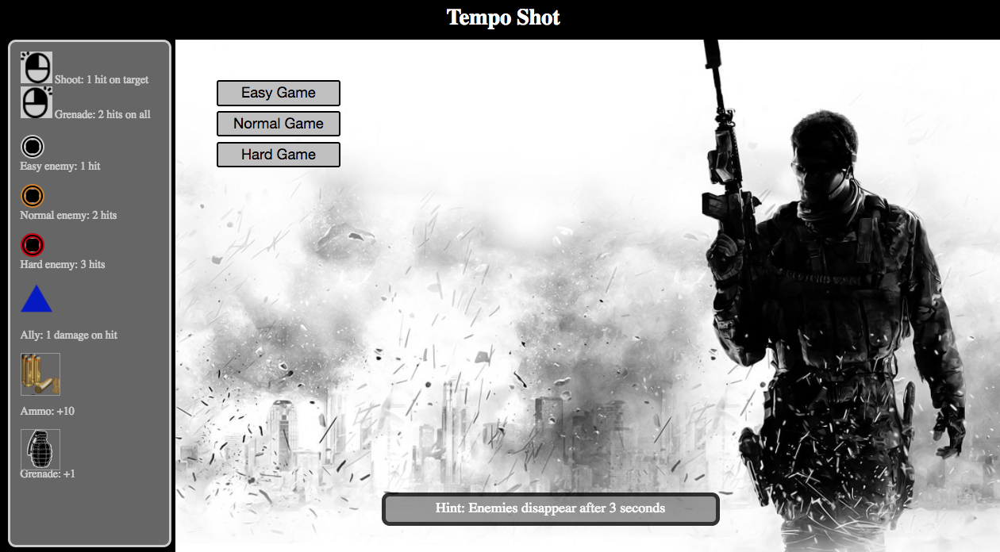

# Project #1: Tempo Shot
Created by: [__Ming Yi Koh__](https://github.com/mingyikoh)
<br>

[*Click here to play*!](https://mingyikoh.github.io/project-1/)


---
## Overview
*Tempo Shot* is a music based first-person-shooter game that tests your reflexes and judgement. Managing your inventory of ammo and grenades is key to winning.

*Please turn on your volume while playing.*

#### Objective
Survive for *two* minutes. Lose all health and you lose.

#### How to play
Use your mouse to aim and left click to shoot them. Shooting enemies will damage them, some enemies require more shots to kill. Failure to kill them before they disappear will reduce your health.
Right click to use *grenades* which damage all visible enemies.
Shooting *allies* cause you to lose a health.
Shoot *ammo boxes* or *med packs* to refill your supplies and health.

#### Controls
*Mouse Left Click*: **Shoot** (One damage to targeted enemy)<br>
*Mouse Right Click*: **Grenade** (Two damage to all enemies)

---
## Technical Documentation
* Game Logic Flow-Chart
* Coding Theory
* Future Possible Updates
* Coding Sequence
* Acknowledgements

#### Game Logic Flow-Chart


#### Coding Theory
This game has only one victory and one failure condition.
The spawns(enemies/utilities) are the main element of the game. Using an object constructor function allows storing of numerous keys and elements for each enemy.
It also allows for future addition of enemy types and effects. Spawns are pushed into an empty array for storage.
Example of object constructor:
```
function Spawn(life, damageOnPlayerWhenExpire, timeTillExpire, effectOnPlayerHealthWhenShot, effectOnPlayerAmmoWhenShot, effectOnGrenadeWhenShot, idLink){
  this.life = life;
  this.damageOnPlayerAtExpire = damageOnPlayerAtExpire;
  this.timeTillExpire = timeTillExpire;
  this.effectOnPlayerHealthWhenShot = effectOnPlayerHealthWhenShot;
  this.effectOnPlayerAmmoWhenShot = effectOnPlayerAmmoWhenShot;
  this.effectOnPlayerGrenadeWhenShot = effectOnPlayerGrenadeWhenShot;
  this.idLink = idLink;
}
```
On each spawn, a div will be created and appended. A counter is used to link the enemy div with the specific enemy array element. Each spawn is given a unique ID using the counter, and an idLink of the same value for the array element, afterwhich the counter increases for the next spawn.
Enemies/allies/tools spawn via a setInterval function. Different enemies have different spawn rates.

On shooting spawns, function will iterate object key and value to determine effect on player stats.
Enemies deal damage to player on expiry.

To add variety in the game, events are created that spawn i.e. 300 enemies at the same time, which forces players to use the grenade. Individual levels are created by matching spawn rate and events with the tempo of the background music of the specific level.

#### Future Possible Updates
* Scoring function
* Combo function
* Pause button
* Text popups at game screen, 'Miss!' etc.
* Enemies zoom to player (transition effect) when they expire, like a bullet path
* Text notification on miss etc.


#### Misc Issues
* No max health
* Using grenade on 5 allies and 1 healthpack will result in gameover.<br> Though 5 health - 5 + 1 = 1 health

#### Coding Sequence

1. Create basic html, game screen layout
1. Create win and lose condition
1. Create object constructor
1. Create spawn function for div creation and individual enemy types
1. Link spawn div and array object
1. Create timer and countdown function so win condition can be met
1. Create function so enemies deal damage to player on expiry
1. Create checkLoss function to check player health so loss condition can be met
1. Target this.div on click to derive key/value
1. Left and right click functions
1. Adjust CSS
1. Adjust setInterval to adjust game difficulty
1. Adjust spawn locations
1. Game overlay to cover game screen before play
1. Start button, Retry button
1. Add BGM, gunshot and grenade audio on click
1. Add easy and hard levels, new BG BGM Events


#### Acknowledgements
* **Alex Min** (TA)
<br>For the precious help and guidance rendered through individual consultations

* **Hazel Toh** (WDI 12)
<br>For the much needed assistance in editing images used in the game

* **Songs**
  <br>[Escape the Fate - "One For The Money"](https://www.youtube.com/watch?v=szRDiLUduRA)
  <br>[Tokyo Ghoul - "Unravel"](https://www.youtube.com/watch?v=Q0v3ajXh5S0)
  <br>[Imagine Dragons - Believer](https://www.youtube.com/watch?v=7wtfhZwyrcc)
