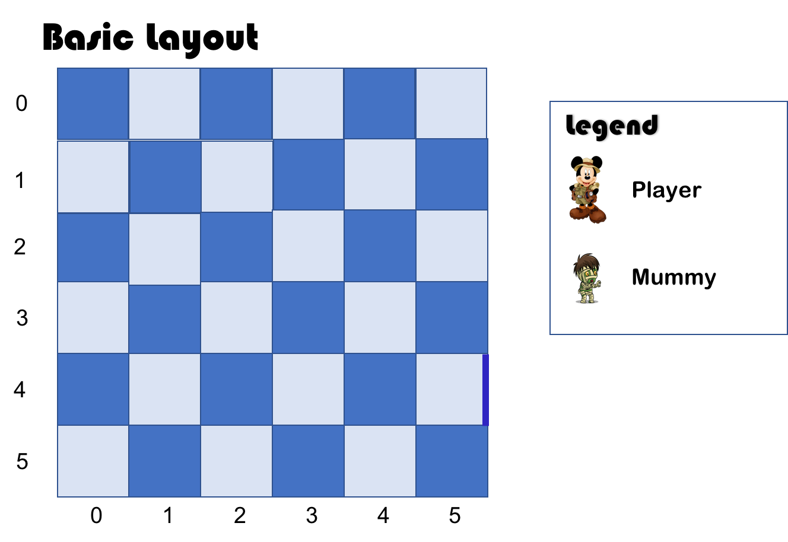
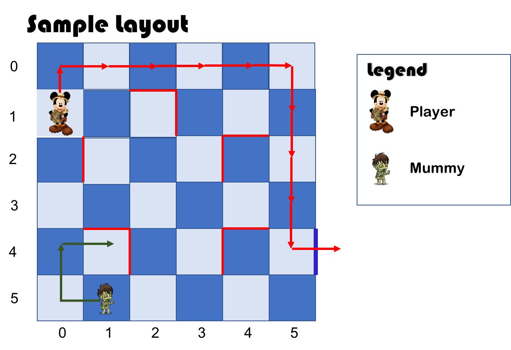
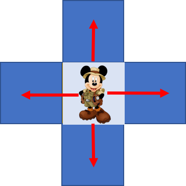
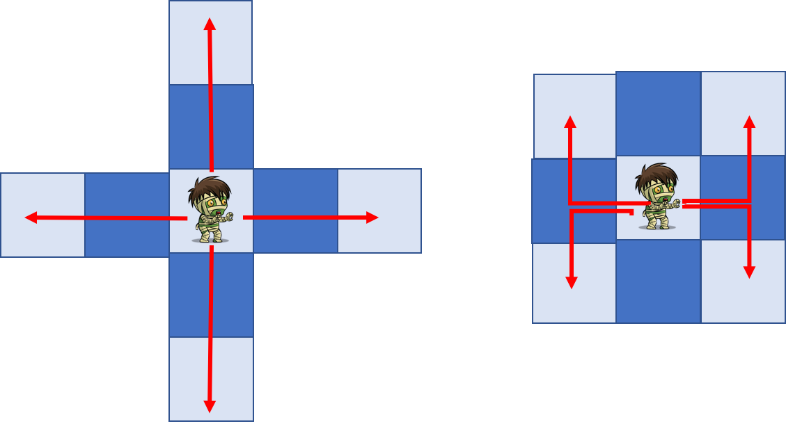
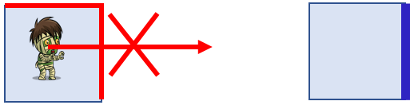
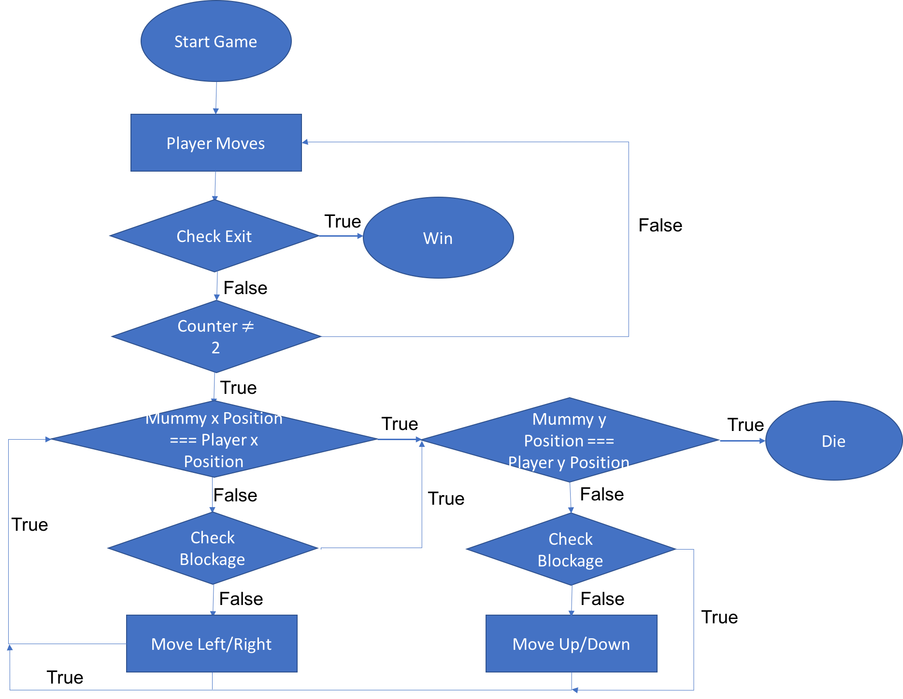

#  Project #1: Mummy Maze

You are trapped in a chamber with a mummy. The mummy seemed to follow around the chamber with your every single move. There are barriers within the chamber which can temporary block the mummy's moves.

 Your quest is to be able to exit the room before the mummy reaches you. Quick! Your Time is running out!

Play it here
https://thamjieying.github.io/project-1/


Basic Layout
------------


* 6X6 grid layout
* Walls as barriers
* 1 Player
* 1 Mummy
* Exit


### Sample Game Layout


Instructions
---------
### Goal
Reach the exit without being caught by the mummy

### Game Play
1. Player Starts First
2. Player gets to move by 1 grid in any direction
<br>
3. Each move the player makes, the mummy moves towards the player by 2 moves towards the player

4. The walls prevents the mummy from moving towards the player while the player moves towards the exit

5. Once the player gets to the exit, the play is completed, Player proceeds to the next level.

### How does the mummy moves?

1. If the mummy can move horizontally (side to side) to get closer to the player, it will first make a horizontal move
2. Else, the mummy will make a vertical move (up or down) to get closer to the player
3. if the mummy is unable to make any move due to the barriers, it will remain at the same spot.

You can "trick" the mummy into walking into the barriers to buy you some "moves" to get to the exit.

Building the Game
-----------------
### Flow Chart of the Game Logic



### Placing the Barriers on the board
##### Representation of Barriers


##### Sample Representation of the Board Layout using a 2D Array
Empty Board (no barrier)
```javascript
var map = [
[5,1,1,1,1,6],
[4,0,0,0,0,2],
[4,0,0,0,0,2],
[4,0,0,0,0,2],
[4,0,0,0,0,2],
[7,3,3,3,3,8]]
```

### Initialisation of the Game
Setting up the map and exit using a 2D array

```javascript
var map = [
  [5,1,9,1,1,6],
  [4,0,6,0,3,2],
  [10,4,0,2,5,2],
  [4,3,0,0,3,2],
  [4,6,4,2,5,0],
  [7,3,3,3,3,8]]

var exit = [
  [0,0,0,0,0,0],
  [0,0,0,0,0,0],
  [0,0,0,0,0,0],
  [0,0,0,0,0,0],
  [0,0,0,0,0,2],
  [0,0,0,0,0,0],
  ]

  ```

  Setting the starting position of the player, mummy and the exit
  ```javascript
  var charX //x position of the player
  var charY //y position of the player

  var mumX //x position of the mummy
  var mumY //y position of the mummy

  var exitX //x position of the exit
  var exitY //y position of the exit
  ```

### Checking Valid Movement
#### Checking Blockage

Using a switch case to check the tile corresponding each wall. The function returns a true if the movement is blocked and a false if the movement is allowed

example: checking if moving up is valid
```javascript
function checkYBlockTop(x){
  switch(x){
    case 1://top blocked
    case 5://top and left blocked
    case 6://top and right blocked
    case 9://top and bottom blocked
    case 11:// top, left and right blocked
    case 12:// top, right and bottom blocked
    case 14:// top, left and bottom blocked
      return true;//movement is blocked
      break;
    default:
      return false;//movement is NOT blocked
    }
}
```

### Mummy's movement
Mummy needs to get closer to the player. With the player's every move, it will move 2 step closer.

We control's the mummy movement by first checking the relative position of the mummy to the player.
* check relative x position
* move horizontally(if possible)
* check relative y position
* move vertically (if possible)
* if both mummy and player are in the same position, this means that it has reached the end of the game.

###### Deciding to move left or Right
Mummy (x-position) - Player(x-position) = positive (left)
<br>Mummy (x-position) - Player(x-position) = negative (right)

###### Deciding to move Up or Down
Mummy (y-position) - Player(y-position) = positive (up)
<br>Mummy (y-position) - Player(y-position) = negative (down)

### Number of Levels
There are a total of 6 level with increasing difficulty.

### Ending the Game
There are 2 ways that will led to the end of the game
1. Mummy meets the player
2. Player exits the maze

### Challenges
* Linking the movement of the characters with the javascript
* mapping all the combinations of the barriers and representing it on a 2D array.
* Ensuring that the mummies follows the player with the defined logic.

### Improvement
* Creating random levels without presetting the map, character position and mummy position.
* Creating animation for the character.
* Creating more enemies to increase the difficulty of the game.
* Making sure that the character move within the grids
