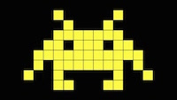
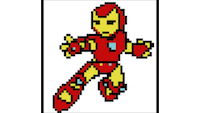
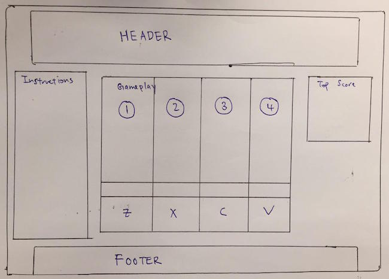
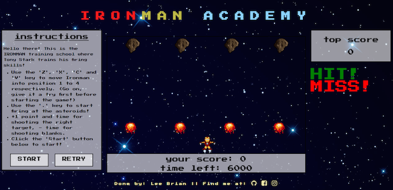
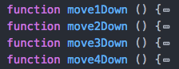
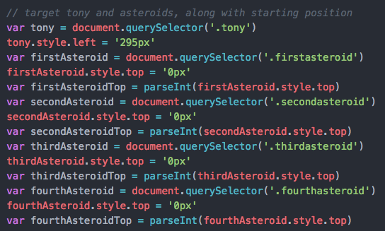
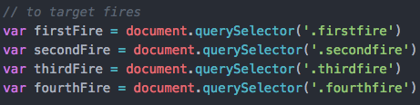

# LeeBrian's Project 1
<!---
Read Me Contents
-->

#  Project #1: IronMan Academy

https://bleetdh.github.io/project-1/
---

### Overview

This is a 1 player, 8 bit game developed using HTML, CSS and JAVASCIPT. It is inspired by old school **Alien** arcade game and Marvel hero **IronMan**.

 

Unlike the conventional Alien game whereby the position of the shooter is flexible, the positions of IronMan are fixed in 4 positions.

---

### Game Instructions ###
* Use the **'Z'**, **'X'**, **'C'** and **'V'** key to move Ironman into position 1 to 4 respectively. (Use your left hand's fingers, including your pinky!)

* Use the **'.'** key to start firing at the asteroids!

* +1 point and time for shooting the right target, - time for shooting blanks.

* Click the 'Start' button to start!

---

### Game Layout ###
This part is achieved using HTML and CSS.
Draft

Actual

---
### Script ###

### Improvements to make ###

* Instead of giving every asteroids and fires in each column a different element, should have used **createElement** and **appendChild** to different column upon generation of random number.

* Should have used more callback functions to call for repetitive functions.

* This could reduce my javascript by ALOT!

---

### Future Development ###
* Collision of 'FIRE' and 'ASTEROIDS'

* Decoy 'ASTEROIDS' that will decrease points and time.

* More levels of difficulty

---

### Acknowledgement ###
* Prima Aulia (my Awesome WDI Instructor!)

* Wong Shimei (my very patient TA!)

* WDI 11 classmates!

* GOOGLE!

---

### Feedback ###
All feedbacks are welcome!
