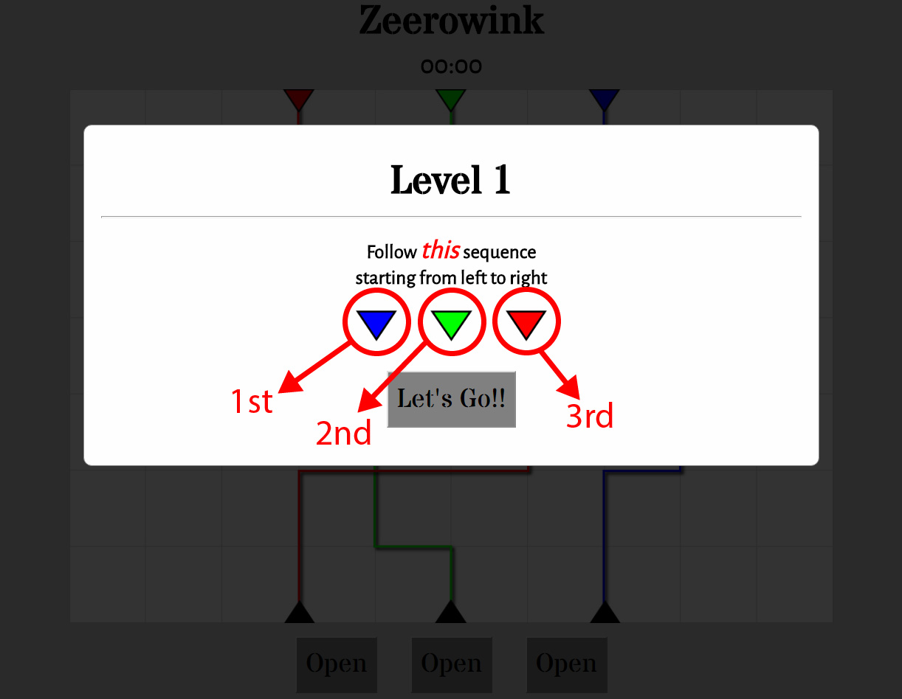
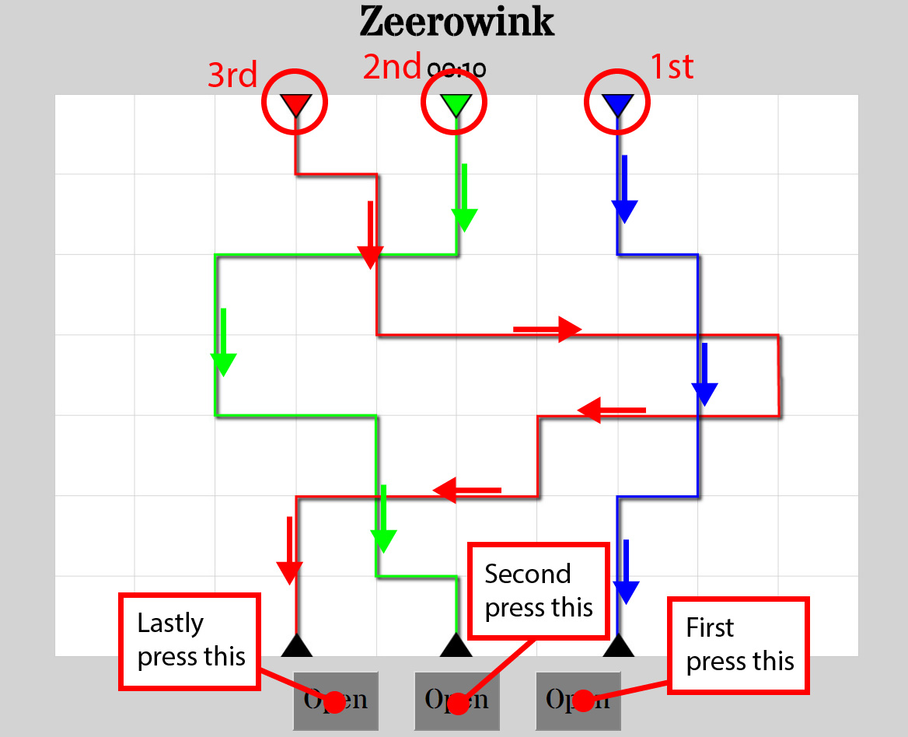
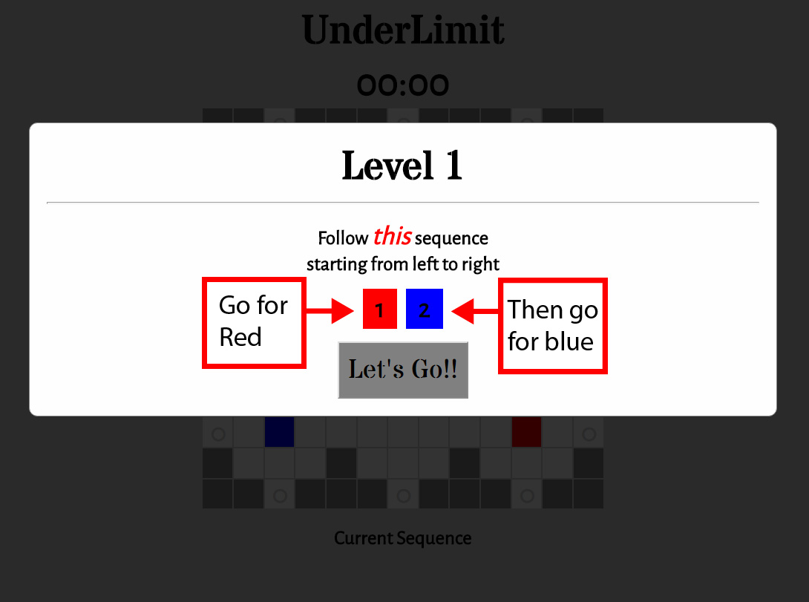
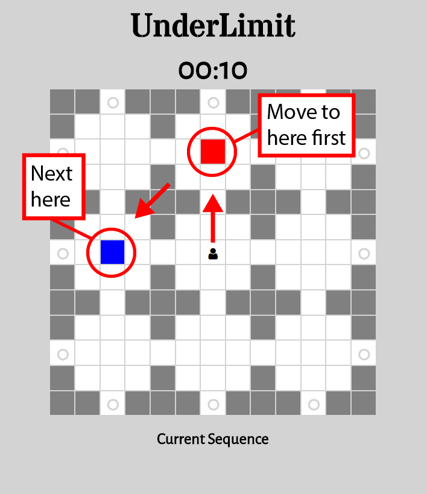
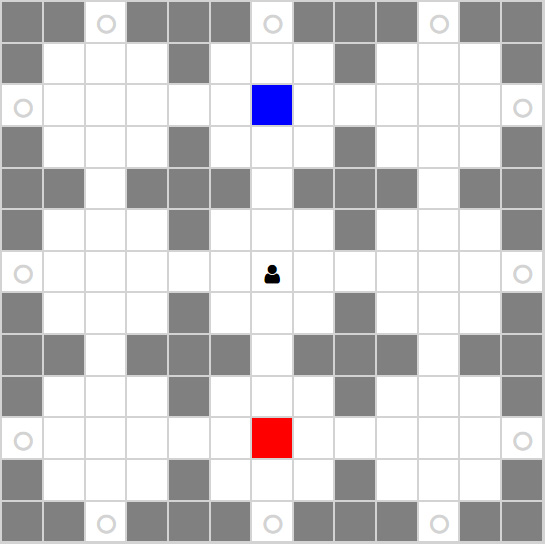

# Zeerowink
<!---
Read Me Contents
-->

#  Project #1: The Game

### The Game Play

#### The objective of this game is to train your concentrating skill.

1. Player has to remember a sequence of colours before starting the game.
2. Once game starts, there will be a countdown timer depending on the difficulty of the game level.
3. Player has to follow the lines according to the sequence they remembered.
4. After going through the line, press the corresponding button to lock the input.
5. Once all the button are pressed, the game will check if your input is the same as the pattern set by the game.
6. If true, process to the next level.
7. If false, retry the current level with a different sequence set by the game.
8. Player will play through 25 levels.
9. Once completed, game will restart to default page and reset to level 1.

---

### Link to game

<https://edmundtck.github.io/project-1>

---

### Wireframes

1. The starting page.

2. Press new game button will show a modal popup with the colour sequence the player has to follow.

3. Press Let's Go button to start the game. Timer will start as well. Solve the puzzle and press the corresponding button below.

4. If player is unable to press the correct sequence or time is up, modal will popup telling player that they have fail and prompt to retry.

5. If player managed to get the sequence correct, modal popup telling them they succeed. prompt player to the next level.

6. Level increase then play the game with increase difficulty.

7. Finish all 25 levels then modal will popup telling player they completed the game. Modal will contain code to Bonus Game.

---

### Puzzle Design

* The game level difficulty increases every 3 level. 
* Change from solid lines to dotted lines. 
* Change from lines that are wide apart to lines that are almost sticking close to each other.

---

### Functions

restart()
* when game finish, the restart button will be called.
* reset variables and set back to game default.

randomInPlay()
* main function with playing mechanism.
* gets game timing, generate random number, get a random combination, set the sequence base on the combination and update the pattern images base on the combination, update the modal.

checkForWin()
* check to see if sequence set by game and player sequence are matching and also clear the set interval.
* base on condition return true or false.

---

### Event Listeners

$('.btn-new-game').on('click', function() {...});
* click new game button - image change, random sequence, show modal, remove new game button, show timer, show level and sequence to play.
* call the randomInPlay()

$('.lets-go-btn').on('click', function() {...});
* timer feature bind to the Let's Go button.
* countdown timer start till the time runs out then call modal for retry.

$('.btn').on('click', function() {...});
* adding click event to the 3 button to register the player input.
* check when all three button are press lock.
* base on checkForWin() return set the attribute to update the content on the modal - to retry, to next level or end game.

$('.next-or-retry').on('click', function() {...});
* either you move on to the next level, retry the current level or game end.
* if next level, the level counter will increment by 1.
* either trigger randomInPlay() or restart().

$('#form').on('submit', function(e) {...});
* add on game, on submit code, check if same as code defined. if same, form disappear and link to bonus game appear.

---

### Add On Game

# UnderLimit

### The Game Play

#### The objective of this game is to train your memory skill.

1. Player has to remember a sequence of colours before starting the game.
2. Once game starts, there will be a countdown timer depending on the difficulty of the game level.
3. Player need to use the keyboard arrow button to navigate the maze.
4. Collect the colours in sequence.
5. Once all the colours are collected, the game will check if your input is the same as the sequence set by the game.
6. If true, process to the next level.
7. If false, retry the current level with a different sequence set by the game.
8. Player will play through 15 levels.
9. Once completed, game will restart to default page and reset to level 1.

---

### Maze Design

* Constructed base on multiple div. 
* Its a 13 x 13 grid.
* A portion of the (x, y) axis will act as walls while the rest will be paths for player to travel.
* A certain (x, y) axis will be spots use for restarting the game

---

### Functions to setup the game board

generateGrid()
* create grids for the game board
* looping through to check for particular sequence to be created with either wall or path
* adding restart points on certain coordinates

generateSequence()
* get the game level to set the length of the array
* create random numbers base on the length and push to sequence array

function generateSpots() {
* generate random spot for the colours around the 8 sections

generateSequenceColor()
* base on generateSequence(), get the numbers to link with the colours

---

### Functions for key directions

settingOfCoordinate(newX, newY, oldX, oldY) {
* set coordinate for old and new (x,y).
* old path becomes previous
* new path becomes active
* check if land on colour spot

leftKey()
* check if move can go left
* not into block or out of border
* check if player go to restart area  

upKey()
* check if move can go up
* not into block or out of border
* check if player go to restart area

rightKey()
* check if move can go right
* not into block or out of border
* check if player go to restart area

downKey()
* check if move can go down
* not into block or out of border
* check if player go to restart area

---

### functions for clear and restart

clearStage()
* prepare game for retry or next level

restart()
* restart to starting page

---

### Functions for block interval and winning condition

randomObs()
* generate obstacles block on random interval coordinates

checkForWin()
* passing of true or false. check if array for game and player is the same

winOrLose(checkForWin)
* depend on checkForWin(), game retry, game next level or end game for modal

---

### Event Listeners

$('.new-game').on('click', function() {...});
* create the game maze, show or hide certain things

$('.next-or-retry').on('click', function() {...});
* base on winOrLose(), player will be clicking on next level, retry or game end

$('.lets-go-btn').on('click', function(e) {...});
*  get timer from gameSource and set countdown timer
*  base on level set the interval for obstacles

$(document).on('keydown', function(e) {...});
* sense the keydown of the arrow button
* if player and game array same length, call winOrLose()

---

### Area for Improvement

* make it responsive to mobile
