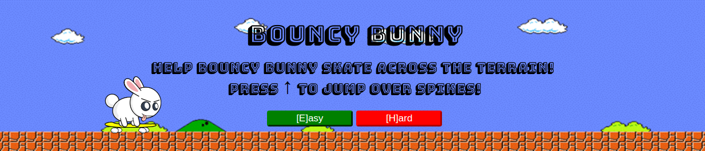
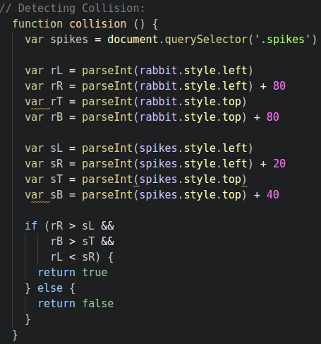
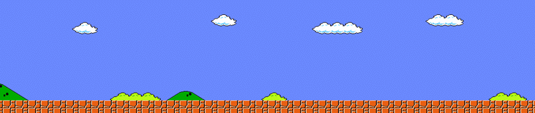
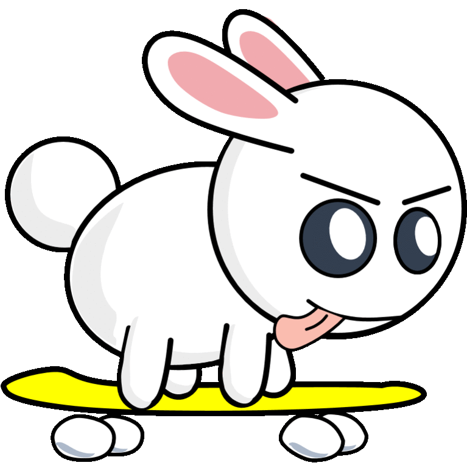
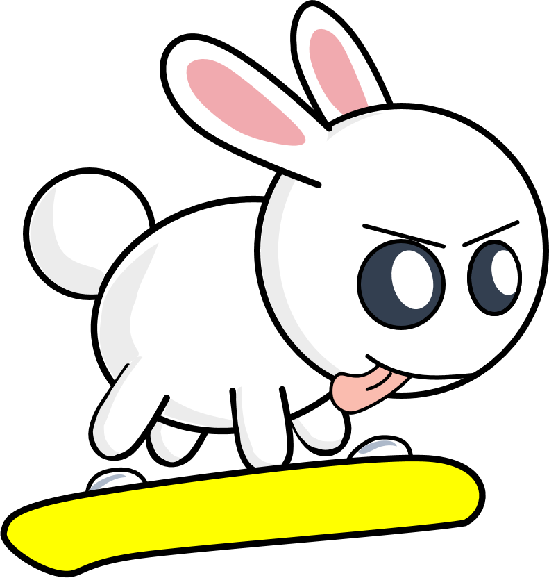

<!---
Read Me Contents
-->

#  Project #1: The Game
# The Bouncy Bunny
**[Play It Here](https://karl-x.github.io/project-1/)**

### Overview

The Bouncy Bunny is a 2D side-scrolling game, inspired by Google's T-Rex Game.
User controls the character with a single key, jumping obstacles as the come.

---

### Game Controls

* **'Up Arrow'** - primary control of the character
* **'E'**, **'H'** - toggle between Easy and Hard mode
* **'P'** - pauses the game
* **'R'** - resets the game

**All controls may also be initiated on mouse click.**

---
Game Script
---
**startGame ()**
* Starts countdown()
* Starts timeout for gameOver()
* Sets value for gameStarted to true

**Starting The Game:**
* Game is initiated by user's choice of difficulty (Easy vs Hard)
* Easy initiates gameModeEasy(), Hard initiates gameModeHard()

**gameModeEasy()  &  gameModeHard():**
* Starts createSpikes() - creates a spike.
* Starts moveSpikes() - moves the created spikes by 10px across the screen from right to left.
* Starts collision() - detects if the objects intersect.

* Starts Timer() - a  timer was used to represent a scoring system

**collision():**
* Logic behind detecing a collision

**Character Controls:**
* canJump() - prevents the user from floating the character above the obstacles
* jump() - enables the rabbit to move over the obstacles
* drop() - brings the rabbit back to initial state immediately

**Misc Controls:**

**Pausing The Game**
* pause() initiates a confirm box - if cancel is selected, rePause() will be initiated
* rePause() - reinitates pause()
* pause() also initiates blur(), which filters out the background
* undoBlur() will occur if 'ok' is selected in the confirm box

**Restarting The Game**
* runs restart() which reloads the browser
* function can be initiated at any point during gameplay, or game over

---

### Design

* Moving background image made from an image disected and made into gif.

* Phases of Character Design:

---

### Issues Faced

* Usage of getBoundingClientRect() created a lot of errors in the moveSpikes(), where spikes were commonly seen headed in unwanted directions.

* Issue was solved by implementing .style.left/right/top/bottom, but not without difficulties at the onset - where it was found that JavaScript could not pull values determined in CSS.
* Oustanding issues unresolved: inability to implement a switch to Hard mode after X amount of time/ score.

* A recursive setTimeout was initially used in tandem with a timer however this caused stacking issues.

---

### Lanugages

* HTML
* CSS
* JavaScript

---

### Acknowledgements

* **[Play Area Image](http://www.deepbluethemes.com/images/mario-game-aquarium-background-custom-001.jpg)**
