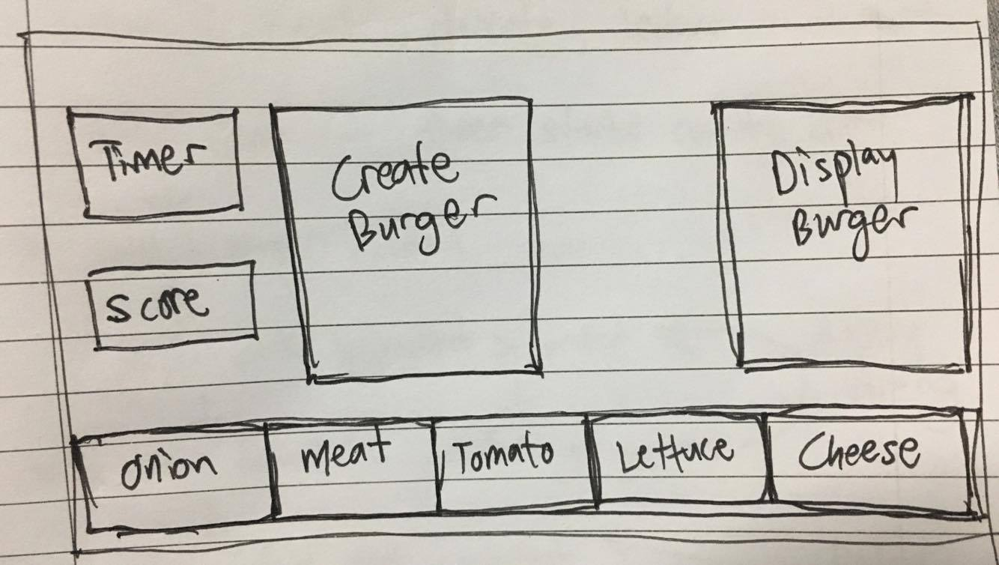

# General Assembly Singapore Web Development Immersive 11

#  Project #1: Burger Stack-it
---
### INSTRUCTIONS

 **The game -**
https://ddanielnp.github.io/project-1/

**A single player** game with a score system that promotes challenge with peers

1. To start the game, Press the **O** button. This will start the timer countdown of **60s**

2. The game can be reset by the **P** button

3. **Q** , **W** , **E** , **R** , **T** buttons to add the ingredients

3. A stack of two ingredients will be randomized at the start, with increasing difficulty

4. **10 points** for a completed burger, **-10 points** for a wrong combination

5. The burger should be stacked in order from **bottom up**

6. **Onions** are quite hidden, so look at it carefully

7. **Spacebar** serves the Burger

---

### **HTML**

* **Semantic markup** for HTML and CSS (adhere to best practices)

* Each boxes are in a `div` element for flexible DOM manipulation.

* **7 child divs** each for the various parts of the burger in the **userinput div** and the **displayburger div**

### **CSS**

* Layout was planned and used **CSS** to set widths, heights and alignments to the various `divs`.

* images of ingredients are stored through **CSS** ```background-image: url(./images/bgimg.jpg);```


* **Adds** a shake movement when user inputs and serves a wrong combination. ```inputShake.classList.add('shake-hard', 'shake-constant')```

* **Removes** shake movement after 1000ms ```setTimeout(function () {
  inputShake.classList.remove('shake-hard', 'shake-constant')
  }, 1000)```

### **Javascript** for **DOM manipulation**

* `document.addEventListener` on 'keyup' of **Q** , **W** , **E** , **R** , **T** buttons plays manipulates the `div` classList to add the image to **userinput**, as well as to play a squish().  

* `document.addEventListener` on 'keyup' of **spacebar** runs the function `checkIngredient()`

* **userinput** and **displayburger** has 7`divs` each. The 7`divs` were stored in an array so that the class could be manipulated to be compared in the function```checkIngredient()```.
```
userinput                               displayburger
<div id="u6" class="hamItem"></div>     <div id="d6" class="hamObj"></div>
```

* **Math.random** used to randomize the creation of an ingredient in the function```randomizeIngredient()```.

* function`level1()` calls `randomizeIngredient()` twice
* function `level2()` calls `randomizeIngredient()` thrice, and so on..

* `resetClassPlayer()`  `resetClassDisplay()` Used to clear the added classes of ingredients to the divs.

---
### **Future Developments**
* Onions are a bit of a nuisance.

* Some sort of CSS can be displayed to show that you have selected the ingredient.

* Choosing a wrong ingredient does not let you do anything to

* Creating a correct continous combination for `> 5 turns` could let you add more time for playability, as well as combo points.

* More levels, more ingredients...

* Mute squish option

### Useful Resources

* **[MDN Javascript Docs](https://developer.mozilla.org/en-US/docs/Web/JavaScript)** _(a great reference for all things Vanilla Javascript)_
* **[jQuery Docs](http://api.jquery.com)** _(if you're using jQuery)_
* **[GitHub Pages](https://pages.github.com)** _(for hosting your game)_
* **[How to write readme - Markdown CheatSheet](https://github.com/adam-p/markdown-here/wiki/Markdown-Cheatsheet)** _(for editing this readme)_
* **[How to write a good readme for github repo!](https://gist.github.com/PurpleBooth/109311bb0361f32d87a2)** _(to make it better)_

---
