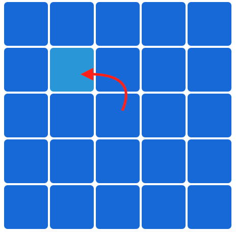

# EYEPOWAH!
<!---
Read Me Contents
-->

#  Project #1: The Game

### GamePlay

Click on the odd colored grid to proceed to the next level.



##### Link to Game:
https://shaunloh89.github.io/project-1/

---

### Grid Design

Grid tiles are spaced with 2px border contained within a 600px space with 10% border radius on every level.

Tiles gradually decrease in size as level difficulty increases.

- Level 1: 2 X 2 Grid
- Level 2: 3 X 3 Grid
- Level 3: 4 X 4 Grid

---

### Game Functions

##### init()
* Initializes game
* Runs the game timer
* Loads level 1 grid
* Changes start button to restart button

##### gameTimer()
* Starts a 60 second countdown that clears if time runs out or the game is over

##### gridCreate()
* Creates and colors grid according to increasing difficulty (i.e. Grid size increases every round)

##### ranNum()
* Generates random number between max and min (with both inclusive)
* Used in randomizing odd tile position and coloring the grid differently every round

##### isMatch()
* Checks if clicked tile matches the odd tile
* Runs a conditional statement and clears previous grid and creates the next level grid if tiles match

##### gameOver()
* Ends the game
* Clears the grid for end of game text displaying score and completion time


---

### Code Discussion

##### Global Variables
```
var score = 0
var timeLeft = 59
var noOfRows = 2
var ranGrid
var isGameOver = false
var wholeGrid = document.querySelectorAll('.container')
var palette = [
  ['rgb(20, 153, 105)',
    'rgb(20, 140, 95)'],
    .
    .
  ]
```

### function gridCreate()
##### Creating the Grid
```
document.querySelector('.container').style.backgroundColor = 'white'
var gridId = 0
for (var i = 0; i < noOfRows; i++) {
  document.querySelector('.container').innerHTML += '<div class = "row">'

  for (var k = 0; k < noOfRows; k++) {
    document.querySelector('.container').innerHTML += '<div class = "L' + noOfRows + 'Grid" id = ' + gridId + '>' + '</div>'
    gridId++
  }
  document.querySelector('.container').innerHTML += '</div>'
}
```
* Styles the grid background as white
* var gridId numbers every grid tile starting from 0
* create <div> rows according to var noOfRows
* create same number of tiles per row

##### Matching DOM class with CSS class (From above extract)
##### Javascript:

```'<div class = "L' + noOfRows + 'Grid" id = ' + gridId + '>'```

##### CSS:
```
/* 5 x 5 grid */

.L5Grid {
  border: 2px solid white;
  width: 116px;
  height: 116px;
  display: inline-block;
  border-radius: 10%;
}
```
* Concatenate string to create matching names with CSS class to retrieve tile properties for different grid sizes


##### Coloring the Grid
```
var palette = [
    ['rgb(20, 153, 105)',
      'rgb(20, 140, 95)'],
    ['rgb(235, 152, 20)',
      'rgb(235, 135, 20)'],
      .
      .
      .
  ]
```
* 2-Dimensional array to store grid colors
* 13 colors for 10 levels to ensure ample rotation
* Array chosen for easy manipulation and looping

```
  var ranChosenCol = palette.splice(ranNum(0, palette.length - 1), 1)
```
* Chooses a color a random from the palette and using splice, removes the color to prevent repetition

```
for (var p = 0; p < noOfRows - 1; p++) {
  for (var j = 0; j < gridId; j++) {
    wholeGrid[j].style.backgroundColor = ranChosenCol[0][0]
  }
}
```
* Nested For loops color the whole grid with the chosen color *ranChosenCol*
* Initial plan was to target by gridId but

```   
wholeGrid.forEach(function (elem) {
      elem.addEventListener('click', isMatch)
    })
```
* Adding event listeners to each element in the grid to check for match

```
ranGrid = document.querySelectorAll('.L' + noOfRows + 'Grid')[ranNum(0, gridId - 1)]

ranGrid.style.backgroundColor = ranChosenCol[0][1]

```
* Randomizes one grid to be the odd tile

### function isMatch()
```
if (this === ranGrid) {

    // target the score node
      var scoreTgt = document.querySelector('.score')

    // update score to score node
      scoreTgt.innerHTML = score + 1
      score += 1

    // increase the grid size
      if (noOfRows < 11) {
        noOfRows += 1
      } else {
        isGameOver = true
        return
      }

    // empty out previous grid squares
      document.querySelector('.container').innerHTML = ' '

    // create the new grid
      gridCreate()
    } else {
      wrongSound()
      timeLeft -= 3
    }
  ```
* If match,
* Updates the score node and score variable
* Increments grid size, clears and creates new grid
* If wrong match, 3 second time deduction

* this refers to each tile in the entire grid, from
```
wholeGrid.forEach(function (elem) {
      elem.addEventListener('click', isMatch)
    })
```
