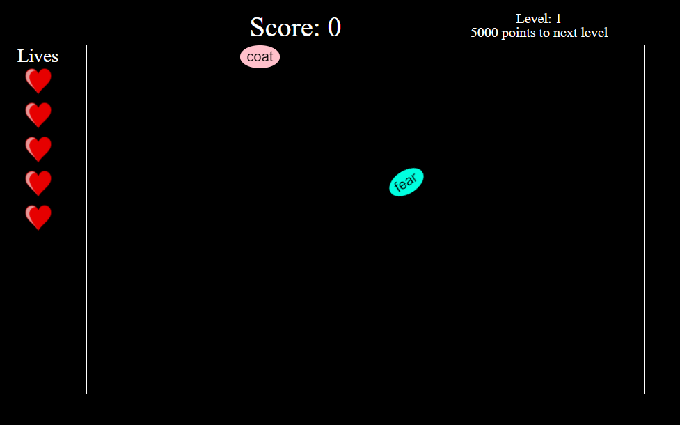
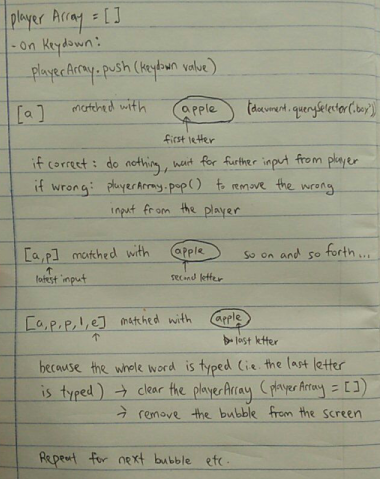
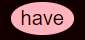
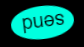
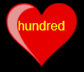
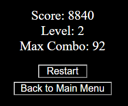

<!-- # Project 1 - Typing Madness -->
<!---
Read Me Contents
-->

#  Project #1: Typing Madness


### Game Interface




---
#### Game link

https://yangtheng.github.io/project-1

---

### Instructions

* Type the words as they appear on the screen contained in oval bubbles, before the oval bubbles land on the bottom of the window!

* You lose a live when one bubble lands on the bottom. Lose all your lives and you lose the game!

* During the game you may encounter words contained in red hearts. These give extra lives to help you survive longer at the higher levels. However the words inside them are longer!


---

### Gameplay Mechanics

#### Main Logic



#### Bubble Movement

* Bubbles are created at random time intervals and random positions along the top of the screen, using the Math.random() native function.

* The 'falling down' effect is caused by applying a transition to each bubble.

* Using the 'transitionend' event, the game is able to detect the moment the bubble reaches the bottom of the screen.

#### Word Database

* A list with the 1000 most common English words was downloaded from Github ( [link](https://gist.github.com/deekayen/4148741) ) and arranged in an array, saved under words.js file. It is accessed by a function in the main js file which randomly adds a word from this array to the bubbles.

#### Level Design

* The game was designed to have unlimited levels (i.e. The game gets progressively harder until the player loses the game.)

* As the level increases, the speed of the bubbles increases, bubbles generate faster and the words in the bubble get longer.

---

### Variables and Functions

* **playerArr**: Represents the array where key values (i.e. letter name on the key) are pushed in when the player presses a key on the keyboard.

* **typeLetter()**: This function is called whenever the player presses a key on the keyboard. It updates playerArr and then calls the logic part of the code to check if the letter matches the corresponding letter in the bubble.

* **gameStart()**: Starts the game: Creates all the in game interfaces and starts the generation of bubbles.

* **checkGameOver()**: Ends the game if there are no lives left.

* **chooseBox()**: Generates a random number to determine the type of bubble being generated (easy, upside down, extra life or two in a row).

* **addWord()**: Generates a random word from the word database and appends it into the bubble.

* **addBox()**: Appends the bubble into the game interface.

* **moveBox()**: Moves the bubble from the top of the game interface to the bottom.

#### Logic

```
function DoesWordMatch () {
  if (DoesLetterMatch() && isWordFullyTyped()) return true
  else return false
}
```

* **DoesWordMatch()**: Returns true if the word is fully typed and matches the word in the bubble.  

* **DoesLetterMatch()**: Returns true if the letter typed matches the corresponding letter in the bubble.

* **isWordFullyTyped()**: Returns true if the size of the playerArr is equal to the length of the word in the bubble.


---

### Game Elements

**Easy Bubble**



**Upside Down Bubble**



**Extra Life Bubble/Heart**



**Gameover Window**



---

#### Technologies Used

* HTML5
* CSS3
* Javascript
