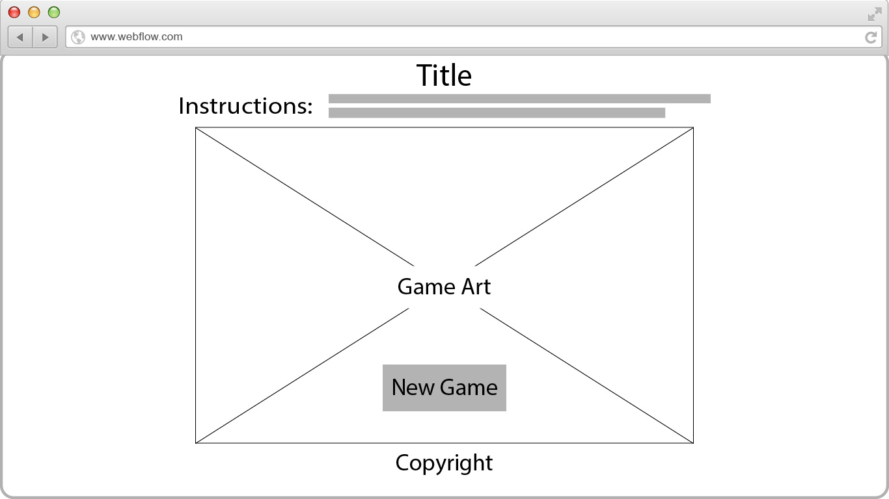
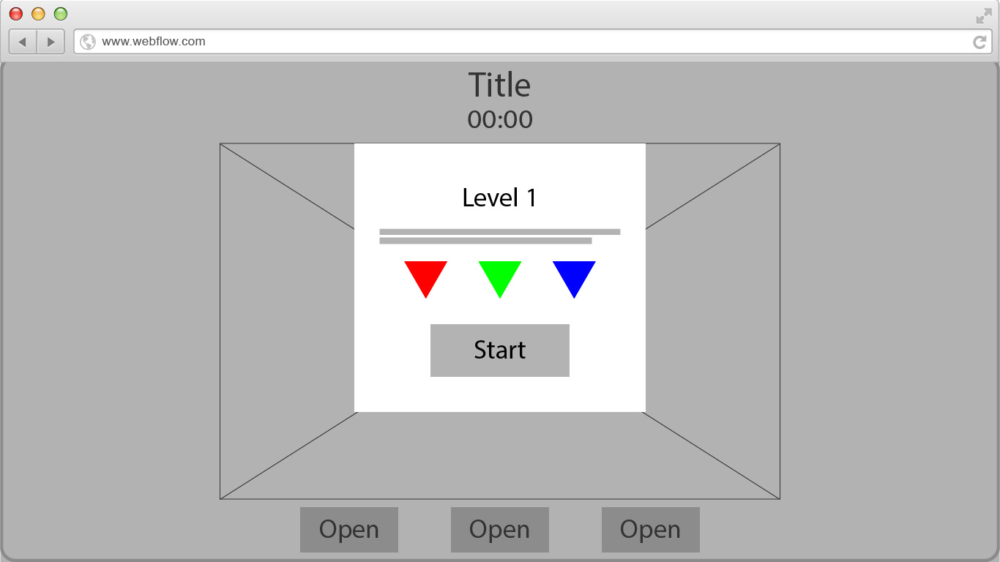
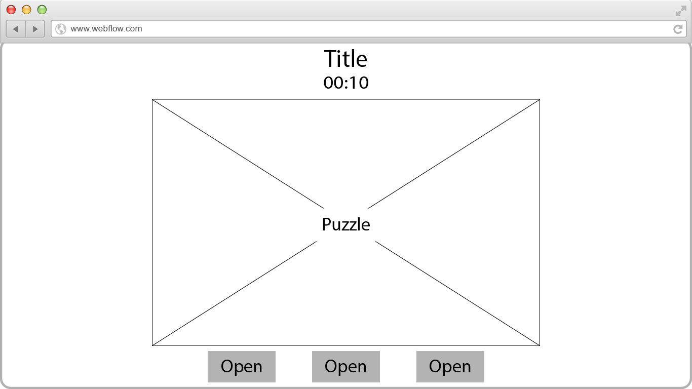
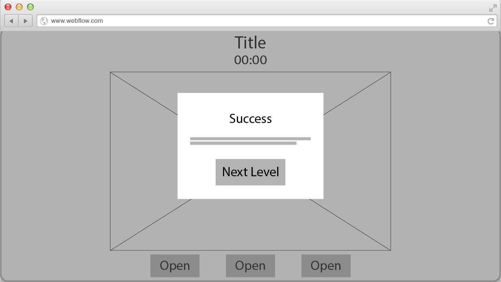
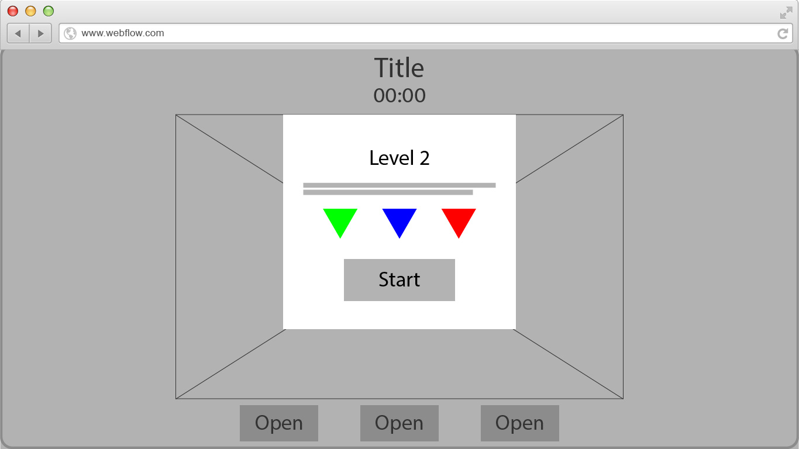
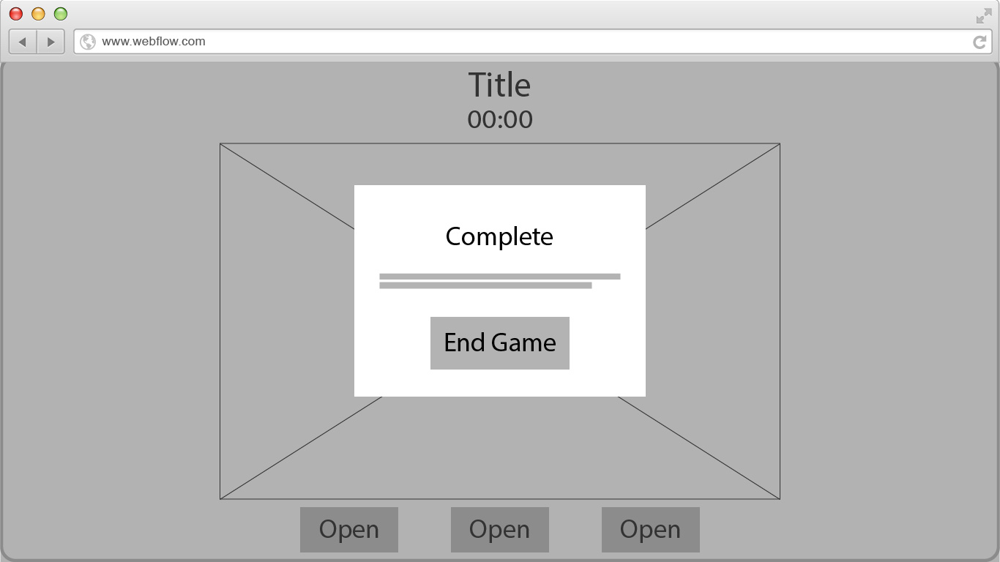
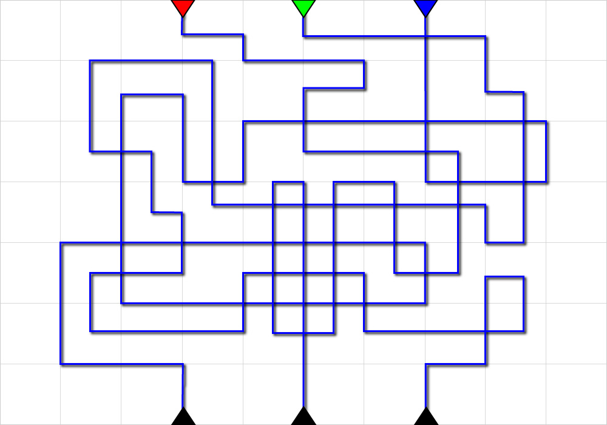
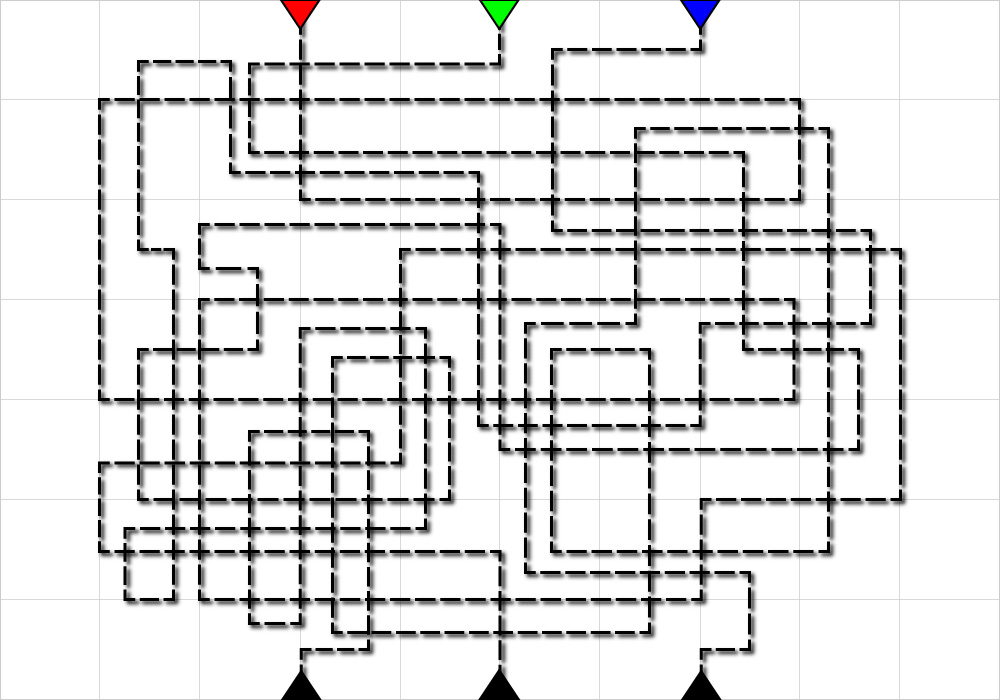

# Zeerowink
<!---
Read Me Contents
-->

#  Project #1: The Game

### The Game Play

The objective of this game is to train your concentrating skill.

1. Player has to remember a sequence of colours before starting the game.
2. Once game starts, there will be a countdown timer depending on the difficulty of the game level.
3. Player has to follow the lines according to the sequence they remembered.
4. Once going through the line, press the corresponding button to lock your input.
5. Once all the button are pressed, the game will check if your input is the same as the pattern set by the game.
6. If true, process to the next level.
7. If false, retry the current level with a different sequence set by the game.
8. Player will play through 25 levels.
9. Once completed, game will restart to default page and restart at level 1.

---

### Wireframes


1. The starting page.


2. Press new game button will show a popup modal to show player the colour sequence to follow.


3. Press Let's Go button to start the game. Timer will start as well. Solve the puzzle and press the corresponding button below.


4. If player is unable to press the correct sequence or time is up, modal will popup telling player that they fail and prompt to retry.


5. If player managed to get the sequence correct, modal popup telling them they succeed. prompt player to the next level.


6. Level increase then play the game with increase difficulty.


7. Finish all 25 levels then modal will popup telling player they completed the game. Modal will contain code to Bonus Game.

---

### Puzzle Design





The game level difficulty increases every 3 level. From solid lines to dotted lines. From lines that are wide apart to lines that are close to each other.

---

### Functions

restart()
* when game finish, the restart button will be fired.
* reset variables and set back to game default.


randomInPlay()
* main for playing.
* get game timing, random number, get a random combination, set the sequence base on the combination and update the triangle image base on the combination, update the modal.


checkForWin(inPlay, player) {
* check to see if they are all matching and also clear the set interval.
* base on condition return true or false.

---

### Event Listeners

$('.btn-new-game').on('click', function() {});
* click new game button - image change, random sequence, show modal, remove new game button, show timer, show level and sequence to play.


$('.lets-go-btn').on('click', function() {});
* timer feature bind to the Let's Go button.
* countdown timer start till the time runs out then call for modal retry.


$('.btn').on('click', function() {});
* adding click event to the 3 button to register the player input.
* check when all three button are press in sequence.
* base on checkForWin return set the attribute to fire which modal - to retry, to next level or end game.


$('.next-or-retry').on('click', function() {});
* either you move on to the next level, retry the current level or game end.


$('#form').on('submit', function(e) {});
* add on game, on submit code, check if same as code defined. if same, form disappear and link to bonus game appear.

---

### Code Discussion

##### Global Variables

```
var minutes, seconds, sequenceInPlay, playerSequence, interval, timer;
var level = 1;
var gameSource = {
  images: {
    red: 'images/project1-triangle-red.png',
    green: 'images/project1-triangle-green.png',
    blue: 'images/project1-triangle-blue.png'
  },
  seqCombination: [
    ['red', 'green', 'blue'],
    ['red', 'blue', 'green'],
    ['green', 'red', 'blue'],
    ['green', 'blue', 'red'],
    ['blue', 'red', 'green'],
    ['blue', 'green', 'red'],
  ],
  level1: {
    red: 1,
    green: 2,
    blue: 3,
    timing: 10
  },
  level2: {
    red: 1,
    green: 2,
    blue: 3,
    timing: 10
    .
    .
  }
```

This object contains the images that will correspond with the sequence of the colour combination.

```
random = Math.floor(Math.random() * 6);
combination = gameSource.seqCombination[random];
sequence = gameSource['level' + level];

// i will be red, blue or green
for (var i of combination) {
  sequenceInPlay.push(sequence[i]);
}

for (var i of combination) {
  src = gameSource.images[i];
  triangleImg += ``;
}

// place on the modal to show the sequence of the triangle
$('.triangle-seq').append(triangleImg);
```

* combination will get a random array of the red, blue, green combination from object seqCombination.
* first loop will get the number for comparison with the player array.
* second loop will get the images link to be append to modal box the show player what is the sequence.

### Add On Game

# UnderLimit

### The Game Play

The objective of the game is to collect the colours in sequence within the time limit.

1. Player has to remember a sequence of colours before starting the game.
2. Once game starts, there will be a countdown timer depending on the difficulty of the game level.
3. Player has use the keyboard arrow button the navigate the maze.
4. Collecting the colours in sequence.
5. Once all the colours are collected, the game will check if your input is the same as the pattern set by the game.
6. If true, process to the next level.
7. If false, retry the current level with a different sequence set by the game.
8. Player will play through 15 levels.
9. Once completed, game will restart to default page and restart at level 1.

---

### Maze Design


Constructed base of div. At certain (x, y) axis it will be block wall or path of player to travel.


---

### Functions to setup the game board


generateGrid()
* create grids for the game board
* looping to check for particular sequence to be created with block or road


generateSequence()
* create random numbers for the game and push to sequence array
* loading the game level to set the length of the array


function generateSpots() {
* generate random spot for the colors around the 8 grids


generateSequenceColor()
* base on generateSequence(), get the number to point to the color


### Functions for keys

// ===================== keys function ======================


settingOfCoordinate(newX, newY, oldX, oldY) {
* set coordinate for old and new (x,y).
* old path becomes previous
* new path becomes active
* check if on colour spot


leftKey()
* check if move can go left
* not into block or out of border
* check if player go to restart area  


upKey()
* check if move can go up
* not into block or out of border
* check if player go to restart area


rightKey() {
* if move can go right
* not into block or out of border
* check if player go to restart area


downKey() {
* check if move can go down
* not into block or out of border
* check if player go to restart area
 ===================== keys function ======================


### clear and restart

================ restart and clear stage ================
* clearStage()
  repare game for retry or next level


* restart() {
   restart to starting page

}

// ================ restart and clear stage ================


// =============== interval for obstacles ===============

* randomObs()
* generate obstacles block on random coordinate

// =============== interval for obstacles ===============


// ================ winning condition ==================


winOrLose(winOrLose)
* depend on checkForWin(), game retry, game next level or end game for modal
// ================ winning condition ==================


// ============== on click buttons ==================

$('.new-game').on('click', function() {

* create the game maze, show or hide certain things


$('.next-or-retry').on('click', function() {
* base on winOrLose(), player will be clicking on next level, retry or game end


$('.lets-go-btn').on('click', function(e) {
*  get timer from gameSource and set countdown timer
*  base on level set the interval for obstacles


$(document).on('keydown', function(e) {
* sense the keydown of the arrow button
* if player and game array same length, call winOrLose()

// ============== on click buttons ==================


Let's start out with something fun - **a game!**

Everyone will get a chance to **be creative**, and work through some really **tough programming challenges** – since you've already gotten your feet wet with Tic Tac Toe, it's up to you to come up with a fun and interesting game to build.

**You will be working individually for this project**, but we'll be guiding you along the process and helping as you go. Show us what you've got!


---

### Technical Requirements

Your app must:

* **Render a game in the browser**
* **Any number of players** will be okay, switch turns will be great
* **Design logic for winning** & **visually display which player won**
* **Include separate HTML / CSS / JavaScript files**
* Stick with **KISS (Keep It Simple Stupid)** and **DRY (Don't Repeat Yourself)** principles
* Use **Javascript** for **DOM manipulation**, jQuery is not compulsory
* **Deploy your game online**, where the rest of the world can access it
* Use **semantic markup** for HTML and CSS (adhere to best practices)
* **No canvas** project will be accepted, only HTML5 + CSS3 + JS please

---

### Necessary Deliverables

* A **working game, built by you**, hosted somewhere on the internet
* A **link to your hosted working game** in the URL section of your GitHub repo
* A **git repository hosted on GitHub**, with a link to your hosted game, and frequent commits dating back to the very beginning of the project
* **A ``readme.md`` file** with explanations of the technologies used, the approach taken, installation instructions, unsolved problems, etc.

---

### Suggested Ways to Get Started

* **Break the project down into different components** (data, presentation, views, style, DOM manipulation) and brainstorm each component individually. Use whiteboards!
* **Use your Development Tools** (console.log, inspector, alert statements, etc) to debug and solve problems
* Work through the lessons in class & ask questions when you need to! Think about adding relevant code to your game each night, instead of, you know... _procrastinating_.
* **Commit early, commit often.** Don’t be afraid to break something because you can always go back in time to a previous version.
* **Consult documentation resources** (MDN, jQuery, etc.) at home to better understand what you’ll be getting into.
* **Don’t be afraid to write code that you know you will have to remove later.** Create temporary elements (buttons, links, etc) that trigger events if real data is not available. For example, if you’re trying to figure out how to change some text when the game is over but you haven’t solved the win/lose game logic, you can create a button to simulate that until then.

---

### Potential Project Ideas

##### Blackjack
Make a one player game where people down on their luck can lose all their money by guessing which card the computer will deal next!

##### Self-scoring Trivia
Test your wits & knowledge with whatever-the-heck you know about (so you can actually win). Guess answers, have the computer tell you how right you are!

---

### Useful Resources

* **[MDN Javascript Docs](https://developer.mozilla.org/en-US/docs/Web/JavaScript)** _(a great reference for all things Vanilla Javascript)_
* **[jQuery Docs](http://api.jquery.com)** _(if you're using jQuery)_
* **[GitHub Pages](https://pages.github.com)** _(for hosting your game)_
* **[How to write readme - Markdown CheatSheet](https://github.com/adam-p/markdown-here/wiki/Markdown-Cheatsheet)** _(for editing this readme)_
* **[How to write a good readme for github repo!](https://gist.github.com/PurpleBooth/109311bb0361f32d87a2)** _(to make it better)_

---

### Project Feedback + Evaluation

* __Project Workflow__: Did you complete the user stories, wireframes, task tracking, and/or ERDs, as specified above? Did you use source control as expected for the phase of the program you’re in (detailed above)?

* __Technical Requirements__: Did you deliver a project that met all the technical requirements? Given what the class has covered so far, did you build something that was reasonably complex?

* __Creativity__: Did you add a personal spin or creative element into your project submission? Did you deliver something of value to the end user (not just a login button and an index page)?

* __Code Quality__: Did you follow code style guidance and best practices covered in class, such as spacing, modularity, and semantic naming? Did you comment your code as your instructors have in class?

* __Deployment__: Did you deploy your application to a public url using GitHub Pages?

* __Total__: Your instructors will give you a total score on your project between:

    Score | Expectations
    ----- | ------------
    **0** | _Incomplete._
    **1** | _Does not meet expectations._
    **2** | _Meets expectations, good job!_
    **3** | _Exceeds expectations, you wonderful creature, you!_

 This will serve as a helpful overall gauge of whether you met the project goals, but __the more important scores are the individual ones__ above, which can help you identify where to focus your efforts for the next project!
