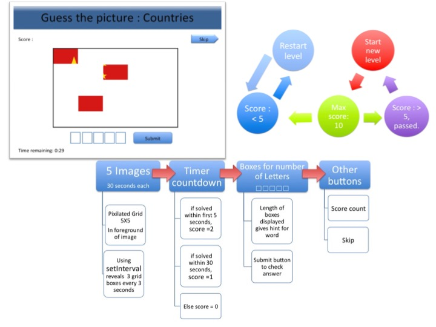

# Guess the Picture: Countries
[Link to game on github](http://g174.github.io/project-1)

Hosted on: [My github repo](http://github.com/g174)
<!---
Read Me Contents
-->

### The game

In this game of guess the picture, more of the flag is revealed with each passing second. Can you identify the country within 30 seconds?
Bonus points awarded for fast fingers, solve the question in 5 seconds to win double points.


### To play

1. Click Start button to play.
2. Textbox placeholder displays hint for word length.
3. Type country in textbox.
4. Click submit to check answer.
5. Score 5 points or more to proceed to level 2.  

---

### Technical Requirements

One player game of trivia.
Made using html, css, javascript.
---
### Coding logic

The flags in the game are shuffled without duplication for each new play.
Using math.random, I generated a random number for randomIndex. The random number identifies the index for the corresponding arrays in var country and var flags. To prevent duplication, each new number is pushed to a usedIndex array and used to filter new random numbers for duplicated entries.

```
//shuffle image without duplicate for next question
function shuffleImg() {
  randomIndex = Math.floor(Math.random()*5)
  if (usedIndex.length < 5){
  while (usedIndex.includes(randomIndex)) {
    randomIndex = Math.floor(Math.random()*5)
  }
  usedIndex.push(randomIndex)
}
  answer = country[randomIndex]
  var flagImage = image[randomIndex]
  var $container = $(".container")
  $container.css("background-image",flagImage)
}
```
___

### Unsolved problems

* If player scores less than 5 in first try, game restarts at a faster pace and does not score correctly.

---

### Ideas for improvement

* Improve on user interface for answers, produce boxes for each letter that only accepts one character. Allows player to visualise the length with ease.
* To increase grid density and number of flags in shuffle as difficulty increase.

---

### Project Evaluation



### Acknowledgements

* **Shumin**
For her endless patience and guidance, this game would not be functional without her help.
