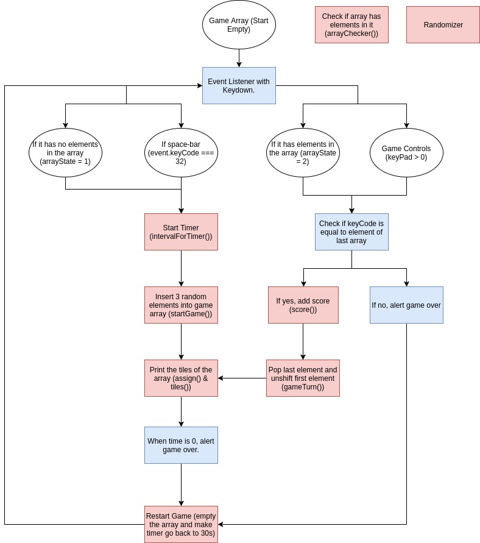

# Project Name (Start editing here)
<!---
Read Me Contents
-->

#  Project #1: Cat-Tile Game

### Overview

A spin-off of the Piano-Tile Game on iOS and Android

The concept of the game is the same as the original, clear as many tiles within a period of 30s to get the highest score possible.

https://dominikphua.github.io/project-1-attempt2/

---
### The Gist of It

The whole game is based on an array. Before the game starts, the array (gameArray) contains no elements in it.

```
var gameArray = []
```

 A keydown event will trigger the first set of random numbers. This is achieved through a function called startGame() which incorporates another function called ranzomier() that radomizes numbers.

 ```
 function gameStart () {
   gameArray.push(randomizer(1, 4), randomizer(1, 4), randomizer(1, 4))
 }
 ```

The gameArray will look something like this in the console:

 ```
[2, 1, 3, 4]
```

Now subsequent keydown events will trigger a function that removes the last element and at the same time adding a new random element in array[0]. The function is as follows:

```
function turn () {
  gameArray.pop()
  gameArray.unshift(randomizer(1, 4))
}
```

Now if we repeat turn () multiple times with each keyDown event, our array will look something like this:

```
[3, 2, 1, 3]
[3, 3, 2, 1]
[2, 3, 3, 2]
[4, 2, 3, 3]
[1, 4, 2, 3]
[1, 1, 4, 2]
```
Can you see the pattern? It is as if the first number of the array is traveling from left to right with each new array.

Now we introduce the event checker. The game only allows you to proceed if the variable assigned to the keydown is the equal to array[3]. For example if

```
var A = 1
var B = 2
var C = 3
var D = 4

//where A is the variable created when key A is pressed etc.
```
then for the above arrays we created with each keydown, it must pass the following checker in order to proceed with the game:

```
function () {
  gameArray[3] === X
}

// where X is either A, B, C or D
```
---
### Flowchart


---

### Improvements
