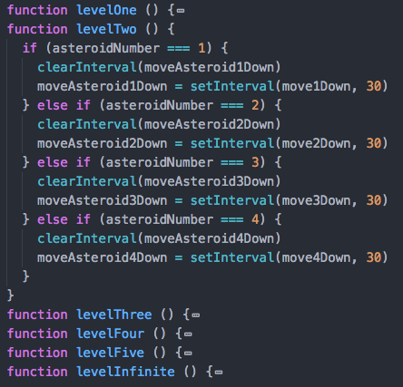

# Lee Brian's Project 1
<!---
Read Me Contents
-->

#  Project #1: IronMan Academy

https://bleetdh.github.io/project-1/
---

### Overview

This is a 1 player, 8 bit game developed using **HTML**, **CSS** and **JAVASCIPT**. It is inspired by old school **Alien** arcade game and Marvel hero **IronMan**.

 

Unlike the conventional Alien game whereby the position of the shooter is flexible, the positions of IronMan are fixed in 4 positions.

---

### Game Instructions ###
* Use the **'Z'**, **'X'**, **'C'** and **'V'** key to move Ironman into position 1 to 4 respectively. (Use your left hand's fingers, including your pinky!)

* Use the **'.'** key to start firing at the asteroids! (Upon '.' key, Ironman will turn towards asteroids to FIRE!)

* +1 point and time for shooting the right target, - time for shooting blanks.

* Click the 'Start' button to start!

---

### Game Layout ###

Draft

Actual

Made use of **min-width** in case of resizing of browser.

---
### Script ###

* To make asteroids appear and disappear, made use of **style.visibility** and **style.opacity**(for fires). Generation of asteroids is random.

* To make my asteroids drop down, used **setInterval** and **clearInterval**. **firstAsteroidTop** is the value of **style.top**. Each loop will +2 to the top value.

* To set different levels at different score, **setInterval** to less time. BUT must remember to **clearInterval** first.

---

### Improvements to make ###

* Instead of giving every asteroids and fires in each column a different element, should have used **createElement**, **appendChild** and **removeChild** to add to or remove from the various columns. Could even allow for more rows.

* Should have used more **callback functions** to call for repetitive functions.

* To set different levels of difficulty without hardcoding so that I can have more infinite levels!

* These could make my javascript by DRY-er!

---

### Future Development ###
* Collision of 'FIRE' and 'ASTEROIDS'.

* Decoy 'ASTEROIDS' that will decrease points and time.

* More levels of difficulty. INSANEEEEEE!

---

### Acknowledgement ###
* Prima Aulia (my Awesome WDI Instructor!)

* Wong Shi Mei (my very patient TA!)

* WDI 11 classmates!

* GOOGLE!

---

### Feedback ###
All feedbacks are welcome!
