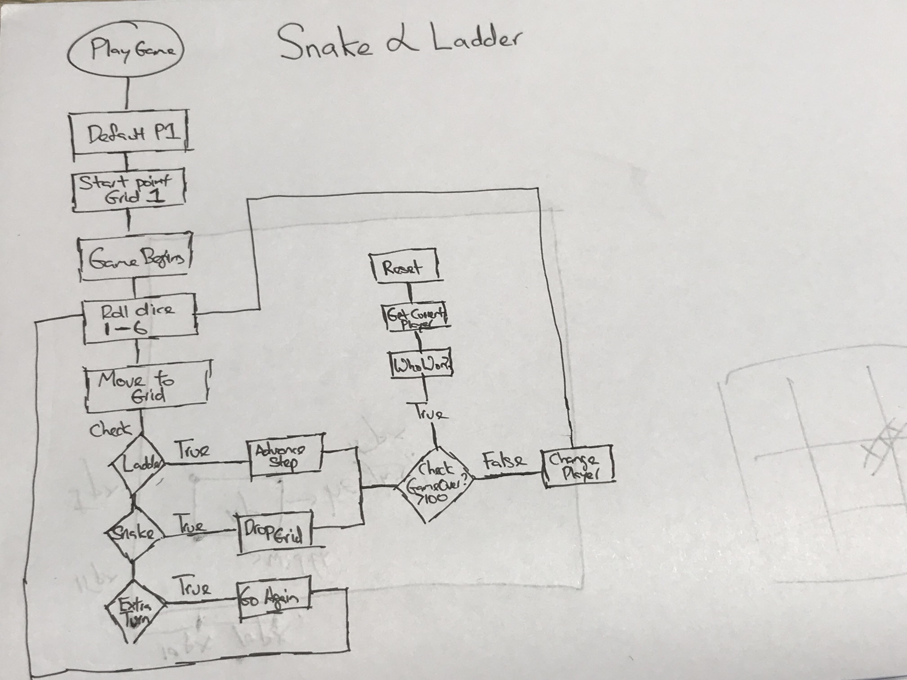

# Snake & Ladder

Game Link: https://matthewfrancisong.github.io/project-1/

## Table of Contents

1. How to play
2. Why Snakes & Ladders
3. My 7 days plan
4. Game Documentation
5. References

## How to Play

Goal: Reach above and beyond square numbered 100 at the top-left hand corner of the board.

Players begin at square number 1. Each player takes a turn to roll a dice and move them along the numbered squares. If a player lands on a square which has the base of a ladder, they will advance to the square that sits on the top of the ladder.

Similarly, if a player lands on a square which has the head of a snake, it would drop to the tail of the snake.

## Why Snakes & Ladders

When I was young, I played a lot. Everything from board games, donkey cards to remote-controlled cars. I thought how wonderful would it be to design the game that I actually played then. It was meaningful.

Some of the animated characters in this game brought me back to happy memories where I remembered slogging thousands of hours. It was all fun.  Wonderful memories to recollect and one day share with my family.

## 7 days Plan

#### 29th Sept
##### Day 1: (Friday)

1.  Flow-chart
2.  Pseudo Codes

#### 30th Sept
##### Day 2 & 3 (Weekend)

1. Create 16 grid MVP (Minimal Viable Game)

  * Logic to switch players
  * Win-Game condition. Create 2 markers. if >16, win game
  * Reset Function
  * Snakes & Ladders Logic

2. Make game functional

#### 2nd Oct
##### Day 4 (Monday)

1. Create actual game. (100 Grid)

Deliverables:
1. Jquery 100 Grid
  * Use JQuery to create 100 grids instead of using html.
  * Use for-loop to give each individual grid an ID.
  * Use modular function to alternate grid background color.
  * Reverse rows so that board number flows bottoms-up in a zig-zag fashion.
2. WhoWon() , Reset() , rollDice() Functions.

Challenges:
 * Refactoring html 16grid into Jquery nested loop function.
 * Create a div instead of '<table'. Learnt that table has its own properties.

#### 3rd Oct
##### Day 5 (Tuesday)

Deliverables:
1. Refactoring Snakes & Ladder Logic
2. Comparison analysis with other snakes and ladder board games to set difficuity.

Challenges:
* Choosing between creating an Array to house logic or a Switch statement
* Reduce player 1 and player 2 codes as there were many repetitions.

#### 4th Oct
##### Day 6 (Wednesday)

Deliverables: (CSS Styling)
1. Find snakes, ladder, and button images.  
2. Color & Style Snakes & Ladders
3. Use Sprite to animate my characters
4. Design Layout of landing page of divs

#### 5th Oct
##### Day 7 (Thursday )

Deliverables: (CSS Styling)
1. Cleaning up Codes
2. Cleaning up UI of page.
3. Inserted audio track
4. Created auto-play & reset feature

Challenges:
1. Tried to use transition-duration to create delay in my character movement.
2. Had to priortise on using the remaining time to touch up & style the layout.

#### 6th Oct
##### Day 8 (Friday)

Presentation Day!

## References
1. Font taken from FGOnlyHope
http://www.fontspace.com/kimberly-geswein/kg-onlyhope
2. Zombie Lupid Sprite - Ripped by Boo
3. Hog Sprite - Ripped by Mageker

