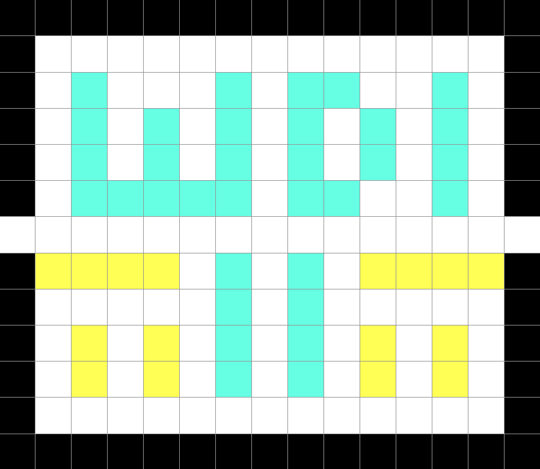

#  Project #1: Simple Pac-Man

This game is inspired by the iconic video game, PAC-MAN.

---

## How to play?

#### Instructions:

* Use the **arrow keys** :arrow_up: :arrow_down: :arrow_left: :arrow_right: to move Pac-Man around the maze.
* Complete the level by eating all the dots.
* **Avoid the ghosts!** If they catch you, you will lose a life.
* You only have **3 lives**. Be careful!

#### URL:

* **[Simple Pac-Man](https://shumin13.github.io/project-1/)**

---

## Wireframes

#### Draft:

#### Final:

---

## Game Logic

#### createWall (left, top, width, height)
* Create wall on the gameboard

#### createDot (left, top)
* Create dots on the gameboard

#### hitWall (character)
* Check if the character (Pac-Man, ghost) hit the wall (collision function)

#### hitGhost ()
* Check if Pac-Man hit the ghost (collision function)

#### pacmanMovement ()
* Pac-Man will change direction when the arrow key is pressed
* Pac-Man's position is rounded to the nearest multiple of 40 (size of each 'grid') at every turn
* If Pac-Man hits a wall, he will stop
* If Pac-Man hits a ghost, check for game over

#### ghostMovement ()
* Ghost will move in a default direction
* If ghost hit a wall, he will move in a new random direction (ghostHitWallNewDir function and randomGhostDirection function)

#### checkScore ()
* Keep track of the score based on the number of dots eaten by Pac-Man
* If all the dots have been eaten, check for game over

#### gameOver ()
* Display screen depends on the result (win, lose, lives > 1)

#### startGame ()
* Start new game
* Reset all variables

---

## To Be Resolved

* Ghost AI

---

## Built With

* HTML5
* CSS3
* Javascript

---

## Acknowledgements

* [MDN Game Development - Collision Detection](https://developer.mozilla.org/kab/docs/Games/Techniques/2D_collision_detection)
* [A* Search Algorithm](https://en.wikipedia.org/wiki/A%2a_search_algorithm)
