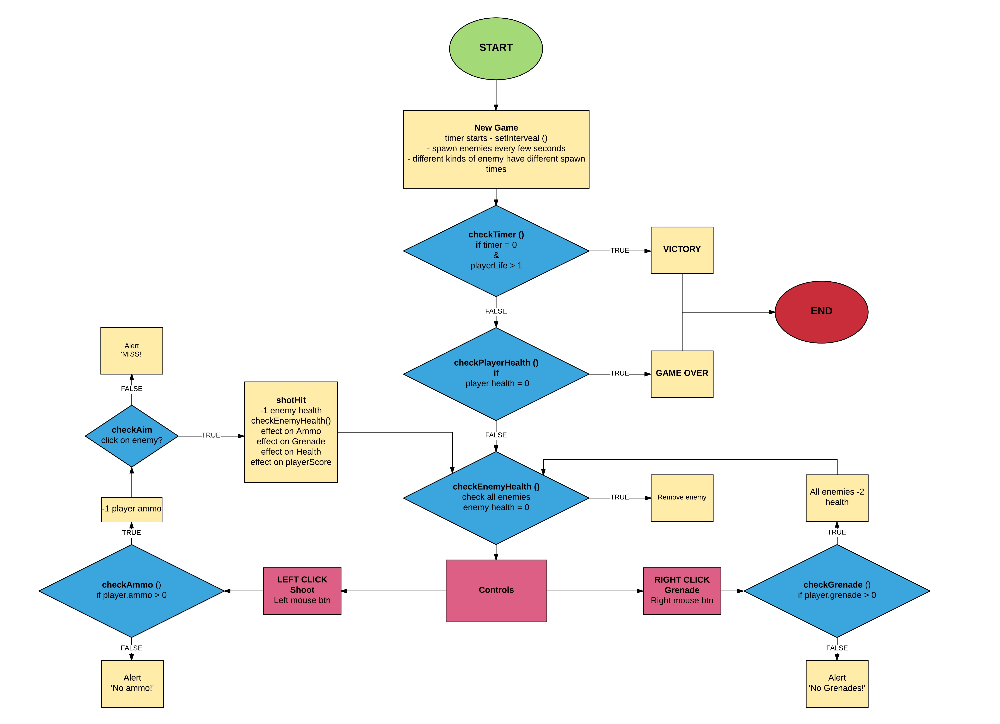

# Project #1: [GAME NAME]

## Overview
*]GAME NAME]* is a first-person-shooter game that tests your reflexes and judgement. Juggle between identifying foes from allies as well as inventory management in the form of ammos and grenades.

#### How to play
Use your mouse to aim and shoot. Shooting enemies will damage them, some enemies require more shots to kill. Failure to kill them before they disappear will reduce your health
*Grenades* damage all visible enemies.
Shooting *allies* cause you to lose a health.
Shoot *ammo boxes* or *med packs* to refill your supplies and health.

#### Controls
*Mouse Left Click*: **Shoot** (damage targeted enemy)<br>
*Mouse Right Click*: **Grenade** (damage all enemies)

#### Conditions for victory:
Survive for *two* minutes

#### Conditions for failure:
Lose all your health

## Technical Documentation
* Game Logic Flow-Chart
* Coding Theory
* Future Updates
* Current Issues (To-Fix List)
* Working On

#### Game Logic Flow-Chart


#### Coding Theory
This is a simple game with only one victory and one failure condition.
Enemies/allies/tools will spawn via a setInterval function.
Different enemies have different spawn time.
They will be created via a constructor function with the following format:
```
enemy{
  life: 1, // default enemies have 1 health
  effectOnAmmo: 0, // ammo boxes +10
  effectOnHealth: 0, // health packs +1
  timeToRemoval: 5 // value reduces with each second
  // on reaching 0, enemy damages player and disappears
}
```
On shooting, function will iterate object key and value to determine effect on player stats.

#### Future Updates
* Scoring function
* More enemy types
* Combo function
* Transition fade enemies

#### Current Issues
EVERYTHING

#### Working On
* Game theory
